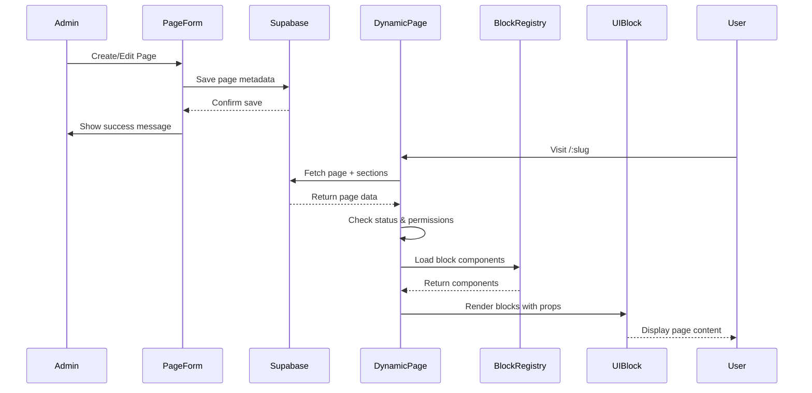

# Project Architecture

## Overview

This project is built using the **Zivan – Creative Agency React Template** with a modern React architecture using Vite as the build tool.

## Technology Stack

### Core Technologies
- **React 18.2** - UI library
- **React Router DOM 6.16** - Client-side routing
- **Vite 5.x** - Build tool and dev server
- **SCSS/Sass** - CSS preprocessing

### UI Libraries
- **Bootstrap 5.3.2** - CSS framework
- **Swiper 10.3.1** - Touch slider
- **React Slick** - Carousel component
- **Iconify React** - Icon system

### Utility Libraries
- **Axios** - HTTP client
- **HTML React Parser** - HTML string parsing
- **React Parallax** - Parallax scrolling effects
- **React Masonry CSS** - Masonry grid layouts

## Project Structure

```
devmart-extreame-zivan/
├── src/
│   ├── components/       # Reusable UI components
│   │   ├── Layout/      # Layout wrappers (Header, Footer)
│   │   ├── Pages/       # Page-level components
│   │   └── [Others]/    # Feature-specific components
│   ├── helpers/         # Utility functions
│   ├── sass/            # SCSS stylesheets
│   │   ├── common/      # Common styles
│   │   ├── default/     # Theme variables
│   │   ├── shortcode/   # Component styles
│   │   └── index.scss   # Main entry point
│   ├── App.jsx          # Main app with routing
│   └── index.jsx        # Application entry point
├── public/
│   ├── images/          # Static image assets
│   ├── data/            # JSON data files
│   └── [assets]/        # Other static assets
├── docs/                # Project documentation
├── vite.config.js       # Vite configuration
├── index.html           # HTML template
└── package.json         # Dependencies and scripts
```

## Architecture Patterns

### Component Organization

#### Layout Components
- **Header** - Navigation, logo, mobile menu
- **Footer** - Footer content, social links
- **Layout/Layout2/Layout3** - Different layout wrappers for various page types

#### Page Components
Page components are organized in `src/components/Pages/`:
- Each page is a self-contained component
- Pages compose smaller reusable components
- Pages handle their own data and state

#### Reusable Components
Organized by feature/function:
- **UI Components**: Button, Card, Accordion, etc.
- **Content Components**: Post, Portfolio, TeamMember, etc.
- **Section Components**: Hero, About, Services, etc.
- **Utility Components**: Spacing, VideoModal, etc.

### Routing Architecture

The application uses React Router v6 with nested routes:

```javascript
<Routes>
  {/* Dark Mode Routes */}
  <Route path="/" element={<Layout darkMode />}>
    <Route path="about" element={<AboutPage darkMode />} />
    <Route path="service" element={<ServicePage />} />
    {/* ... */}
  </Route>
  
  {/* Tech Startup Route */}
  <Route path="/" element={<Layout2 darkMode />}>
    <Route index element={<Home />} />
  </Route>
  
  {/* E-commerce Routes */}
  <Route path="/" element={<Layout3 darkMode />}>
    <Route path="shop" element={<Shop />} />
    {/* ... */}
  </Route>
  
  {/* Light Mode Routes */}
  <Route path="/light/" element={<Layout />}>
    {/* Mirror of dark mode routes */}
  </Route>
</Routes>
```

### Component Organization

The template uses SCSS modules for styling, which are organized into:
- `default/` - Base styles and variables
- `common/` - Shared components (header, footer, theme toggle, etc.)
- `shortcode/` - Reusable content blocks
- Individual component styles

## Theme System Architecture

### Context-Based Theme Management
The application uses React Context API for global theme state management:

**Location:** `/src/contexts/ThemeContext.jsx`

**Features:**
- Theme state (`'dark'` | `'light'`)
- `toggleTheme()` function
- localStorage persistence (`devmart-theme` key)
- System preference detection

**Usage:**
```jsx
import { useTheme } from '@/contexts/ThemeContext';

function Component() {
  const { theme, toggleTheme } = useTheme();
  return <button onClick={toggleTheme}>{theme}</button>;
}
```

### CSS Implementation
Dark theme styles are applied via `.cs_dark` class on root element:
- **Dark mode:** `<div className="cs_dark">...</div>`
- **Light mode:** `<div>...</div>` (no class)

All dark mode styles located in `/src/sass/_dark.scss`.

### Post-Consolidation Route Structure (November 2025)

The application has been simplified to use a single homepage variant:

**Active Homepage:**
- Creative Agency (Home.jsx) at `/`

**Removed Variants:**
- TechStartupPage, MarketingAgencyPage, StudioAgencyPage, DigitalAgencyPage

**Route Structure:**
Single set of routes with theme applied globally:
- `/` - Homepage
- `/about` - About page
- `/service` - Services
- `/portfolio` - Portfolio
- `/blog` - Blog
- `/team` - Team
- `/contact` - Contact
- `/shop/*` - E-commerce pages

No more `/light/` prefix routes. Theme handled by context.
```
sass/
├── default/
│   ├── _color_variable.scss   # Color palette
│   └── _typography.scss       # Font definitions
├── common/
│   ├── _general.scss         # Base styles
│   ├── _header.scss          # Header styles
│   ├── _footer.scss          # Footer styles
│   ├── _spacing.scss         # Spacing utilities
│   └── ...
├── shortcode/
│   ├── _hero.scss            # Hero section styles
│   ├── _iconbox.scss         # Icon box styles
│   ├── _portfolio.scss       # Portfolio styles
│   └── ...
├── _dark.scss                # Dark mode overrides
├── _custom.scss              # Custom modifications
└── index.scss                # Main import file
```

#### Theming System
- SCSS variables for colors, fonts, spacing
- Dark mode implemented via `.cs_dark` class
- Responsive breakpoints defined globally
- Utility classes for common patterns

### State Management

The template uses React's built-in state management:
- **Local State**: `useState` for component-level state
- **URL State**: React Router for navigation state
- **Prop Drilling**: For passing data between components
- No global state management library (Redux, Zustand, etc.)

### Data Management

#### Static Data
- JSON files in `public/data/` directory
- Loaded via Axios on component mount
- Cached in component state

#### Dynamic Routes
- URL parameters for detail pages (`/:id`)
- Route data passed via React Router

## Build Configuration

### Vite Configuration
```javascript
{
  server: {
    host: "::",
    port: 8080
  },
  plugins: [react()],
  css: {
    preprocessorOptions: {
      scss: { /* SCSS config */ }
    }
  }
}
```

### Development
- Hot Module Replacement (HMR)
- Fast refresh for React components
- SCSS compilation on the fly
- Port 8080 for dev server

### Production Build
- Optimized bundles
- Code splitting by route
- Asset optimization
- CSS extraction and minification

## Performance Considerations

### Code Splitting
- Route-based splitting via React Router
- Lazy loading for heavy components
- Dynamic imports for modals

### Asset Optimization
- Image optimization via public folder
- SVG for icons (Iconify)
- Web fonts loaded asynchronously

### Carousel Libraries
- Swiper for modern, touch-enabled sliders
- React Slick for traditional carousels
- Conditional rendering for performance

## Browser Support

Based on Browserslist configuration:
- **Production**: >0.2%, not dead, not op_mini all
- **Development**: last 1 chrome/firefox/safari version

## Accessibility

The template includes:
- Semantic HTML structure
- ARIA labels where needed
- Keyboard navigation support
- Focus management for modals

## Integration with Zivan Template

### Original Template Structure
The Zivan template was originally built for Create React App (react-scripts). This integration maintains 100% visual and structural parity while adapting to use Vite for improved performance.

### Key Adaptations
1. **Build Tool**: Migrated from react-scripts to Vite
2. **Entry Point**: Updated for Vite's module system
3. **Asset Loading**: Configured for Vite's public directory handling
4. **SCSS Processing**: Integrated with Vite's CSS pipeline

### Maintained Elements
- ✅ All components exactly as in original template
- ✅ Complete SCSS styling system
- ✅ All helper functions and utilities
- ✅ Routing structure and page organization
- ✅ Image assets and data files
- ✅ Dark/Light mode functionality
- ✅ Responsive design system

## Pages Module Architecture (Sprint 2 - Implemented)

### Overview
The Pages Module introduces dynamic page management with a composable UI block system. Pages are stored in Supabase and rendered dynamically from reusable UI blocks.

### Data Flow



### Component Structure

```
src/
├── pages/
│   ├── Admin/
│   │   └── Pages/
│   │       ├── PagesList.jsx       # Page management dashboard
│   │       └── PageForm.jsx        # Create/Edit page form
│   └── DynamicPage.jsx             # Public page renderer
├── UIBlocks/                        # 36 reusable UI blocks
│   ├── Hero/                       # 5 hero variants
│   ├── About/                      # 4 about variants
│   ├── Services/                   # 3 service variants
│   ├── Blog/                       # 3 blog variants
│   └── [14 more categories]/
└── utils/
    └── blockRegistry.js            # Dynamic block loader
```

### Key Features

#### 1. Dynamic Routing
- `/:slug` route matches any page slug
- Falls through static routes first
- 404 for non-existent pages

#### 2. Block System
- 36 UI blocks across 18 categories
- Dynamic imports via blockRegistry
- Component caching for performance
- Props stored as JSONB in database

#### 3. SEO Management
- Dynamic meta tags via react-helmet-async
- Title, description, keywords
- Open Graph images
- Canonical URLs

#### 4. Access Control
- Published pages: Public
- Draft pages: Admin only
- Archived pages: 404 error

#### 5. Layout Support
- Layout (default)
- Layout2 (tech startup)
- Layout3 (e-commerce)

### Database Tables

**pages**
- Stores page metadata (title, slug, SEO)
- Status: draft | published | archived
- Layout configuration
- Timestamps and audit trail

**page_sections**
- Links blocks to pages
- Stores block type and props
- Order index for sequencing
- Active/inactive toggle

### Integration Points

#### With UI Blocks System
- All 36 blocks available for composition
- Blocks remain independent components
- No coupling between blocks
- Props passed from database

#### With Routing System
- Dynamic route `/:slug` at end of route list
- Doesn't override static routes
- Works with nested layouts

#### With Theme System
- Blocks inherit theme context
- Dark/light mode support
- Consistent styling

### Performance Optimizations

1. **Code Splitting**
   - UI blocks loaded on demand
   - Only imports used blocks
   - Reduces initial bundle size

2. **Component Caching**
   - Loaded blocks cached in Map
   - Prevents duplicate imports
   - Faster subsequent renders

3. **Suspense Boundaries**
   - Smooth loading states
   - No flash of unstyled content
   - Progressive enhancement

## Future Considerations

### Potential Enhancements
- Add TypeScript for type safety
- Implement React Query for data fetching
- Add Storybook for component documentation
- Integrate testing framework (Vitest)
- Add CI/CD pipeline

### Scalability
- Component library extraction
- Shared component patterns
- Design system documentation
- Performance monitoring

---

**Architecture Version:** 1.0  
**Last Updated:** November 10, 2025  
**Template Version:** Zivan 1.0.0
