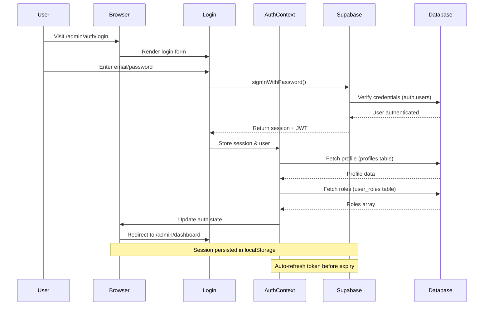

# Backend Documentation

## Current Backend Status

**Backend Type:** Full-Stack with Supabase  
**API Integration:** Supabase PostgreSQL + Edge Functions  
**Authentication:** Supabase Auth with JWT & Role-Based Access Control (RBAC)  
**Data Source:** PostgreSQL Database + Row Level Security (RLS)

## Overview

The Devmart CMS is a **full-stack application** with React frontend and Supabase backend. The system includes a public-facing website and a comprehensive admin panel with authentication, role-based access control, and dynamic content management. Admin users can manage pages, content, users, and system settings through a secure dashboard.

## Data Architecture

### Static Data Files

The application uses JSON files for content:

```
public/data/
├── AllProducts.json      # E-commerce product data
├── services.json         # Service offerings
├── portfolio.json        # Portfolio items
├── blog-posts.json       # Blog content
├── team-members.json     # Team information
└── [other-data].json     # Additional static data
```

### Data Loading Pattern

Components load data using Axios:

```javascript
useEffect(() => {
  axios
    .get('/data/AllProducts.json')
    .then(response => setData(response.data))
    .catch(error => console.error('Error:', error));
}, []);
```

## Client-Side Routing

**Router:** React Router DOM v6  
**Type:** Client-side (SPA)  
**History Mode:** Browser History

All routing is handled on the client side without server-side rendering or API routes.

## Authentication System (Phase 4 - Implemented)

### Overview
The application implements a comprehensive authentication system using Supabase Auth with JWT tokens, session management, and role-based access control (RBAC).

### 2.1 Authentication Flow



### 2.2 AuthContext Implementation

The `AuthContext` provides centralized authentication state management:

**Location:** `/src/contexts/AuthContext.jsx`

**State Management:**
```javascript
{
  user: Object,           // Supabase auth user
  session: Object,        // JWT session with tokens
  profile: Object,        // User profile from profiles table
  roles: Array,           // User roles array ['admin', 'super_admin']
  isLoading: Boolean,     // Auth initialization state
  isAuthenticated: Boolean // Computed from user presence
}
```

**Methods:**
- `login(email, password)` - Authenticate user with Supabase
- `logout()` - Sign out and clear session
- `hasRole(role)` - Check if user has specific role
- `isSuperAdmin()` - Check for super_admin role
- `isAdmin()` - Check for admin or super_admin role

**Key Implementation Details:**
- Uses `supabase.auth.getSession()` on mount to restore session
- Subscribes to `onAuthStateChange()` for real-time auth updates
- Defers profile/role fetching with `setTimeout()` to prevent auth deadlock
- Automatic token refresh handled by Supabase client
- Session persisted in localStorage

### 2.3 Role-Based Access Control (RBAC)

**Role Hierarchy:**
```
super_admin  → Full system access (bypasses all role checks)
├─ admin     → User management, content management
├─ moderator → Content approval, basic admin tasks
└─ user      → Standard user privileges
```

**Database Structure:**

**`profiles` Table:**
```sql
CREATE TABLE profiles (
  id UUID PRIMARY KEY REFERENCES auth.users(id),
  email TEXT NOT NULL,
  full_name TEXT,
  avatar_url TEXT,
  created_at TIMESTAMPTZ DEFAULT NOW(),
  updated_at TIMESTAMPTZ DEFAULT NOW()
);
```

**`user_roles` Table:**
```sql
CREATE TABLE user_roles (
  id UUID PRIMARY KEY DEFAULT gen_random_uuid(),
  user_id UUID NOT NULL,
  role app_role NOT NULL,
  created_at TIMESTAMPTZ DEFAULT NOW(),
  UNIQUE(user_id, role)
);

CREATE TYPE app_role AS ENUM (
  'user', 
  'moderator', 
  'admin', 
  'super_admin'
);
```

**Security Definer Function:**
```sql
CREATE FUNCTION has_role(_user_id UUID, _role app_role)
RETURNS BOOLEAN
LANGUAGE SQL
STABLE SECURITY DEFINER
SET search_path = public
AS $$
  SELECT EXISTS (
    SELECT 1 FROM user_roles
    WHERE user_id = _user_id AND role = _role
  )
$$;
```

**Purpose:** Prevents recursive RLS policy evaluation by executing with owner privileges.

### 2.4 Protected Routes

**ProtectedRoute Component** (`/src/components/Admin/ProtectedRoute.jsx`):
- Checks `isLoading` → Shows loading spinner
- Checks `isAuthenticated` → Redirects to `/admin/auth/login`
- Checks `requiredRole` → Verifies user has permission
- Super admins bypass all role restrictions
- Shows "Unauthorized" page for insufficient permissions

**AuthRoute Component** (`/src/components/Admin/AuthRoute.jsx`):
- Prevents authenticated users from accessing login pages
- Redirects to `/admin/dashboard` if already logged in
- Shows loading state during auth check

**Route Configuration Example:**
```jsx
<Route element={<ProtectedRoute />}>
  <Route path="/admin/dashboard" element={<Dashboard />} />
</Route>

<Route element={<ProtectedRoute requiredRole="super_admin" />}>
  <Route path="/admin/users" element={<UsersList />} />
</Route>

<Route element={<AuthRoute />}>
  <Route path="/admin/auth/login" element={<Login />} />
</Route>
```

### 2.5 Row Level Security (RLS) Policies

**profiles Table Policies:**
```sql
-- Users can view their own profile
CREATE POLICY "Users can view their own profile"
ON profiles FOR SELECT
USING (auth.uid() = id);

-- Users can update their own profile
CREATE POLICY "Users can update their own profile"
ON profiles FOR UPDATE
USING (auth.uid() = id);

-- Admins can view all profiles
CREATE POLICY "Admins can view all profiles"
ON profiles FOR SELECT
USING (has_role(auth.uid(), 'admin') OR has_role(auth.uid(), 'super_admin'));

-- Super admins can manage all profiles
CREATE POLICY "Super admins can manage all profiles"
ON profiles FOR ALL
USING (has_role(auth.uid(), 'super_admin'));
```

**user_roles Table Policies:**
```sql
-- Users can view their own roles
CREATE POLICY "Users can view their own roles"
ON user_roles FOR SELECT
USING (auth.uid() = user_id);

-- Super admins can manage all roles
CREATE POLICY "Super admins can manage all roles"
ON user_roles FOR ALL
USING (has_role(auth.uid(), 'super_admin'));
```

### 2.6 Session Management

**Token Handling:**
- JWT access token (short-lived, ~1 hour)
- Refresh token (long-lived, stored securely)
- Automatic token refresh before expiry
- Tokens stored in localStorage via Supabase client

**Session Persistence:**
```javascript
// Supabase client configuration (auto-configured)
{
  auth: {
    storage: localStorage,
    persistSession: true,
    autoRefreshToken: true
  }
}
```

**Security Considerations:**
- Tokens never exposed in code or console logs (production)
- HTTPS required for production deployment
- Supabase handles token encryption and secure storage
- Session timeout handled automatically

### 2.7 Password Reset Flow

**Implementation:** `/src/pages/Admin/Auth/ResetPassword.jsx`

**Process:**
1. User enters email address
2. Calls `supabase.auth.resetPasswordForEmail()`
3. Supabase sends password reset email
4. User clicks link in email
5. Redirected to password update page
6. New password saved securely

**Email Configuration:**
- Configured in Supabase Dashboard → Authentication → Email Templates
- Uses project's SMTP settings (Hostinger SMTP recommended)
- Redirect URL: `${window.location.origin}/admin/auth/reset-password`

## Integration Points

### Current Integrations
- ✅ **Bootstrap** - UI framework (client-side only)
- ✅ **Iconify** - Icon library (client-side)
- ✅ **Swiper/Slick** - Carousels (client-side)
- ✅ **React Parallax** - Scroll effects (client-side)

### Backend Dependencies
The system integrates with Supabase for backend capabilities:
- ✅ PostgreSQL database with RLS
- ✅ Authentication system with JWT
- ✅ Edge Functions for serverless API
- ✅ Real-time subscriptions
- ✅ File storage and CDN
- ✅ Row Level Security policies

## Future Backend Integration Options

When backend functionality is needed, consider these integration paths:

### Option 1: Lovable Cloud (Recommended)

Enable Lovable Cloud for instant backend capabilities:
- **PostgreSQL Database** - Structured data storage
- **Authentication** - User management with email/password
- **File Storage** - Image and document uploads
- **Edge Functions** - Serverless API endpoints

**Use Cases:**
- User authentication/login
- Dynamic content management
- Form submissions with database storage
- File uploads (team photos, portfolio images)
- Real-time features

### Option 2: External API Integration

Integrate with third-party services:
- **Headless CMS** - Contentful, Strapi, Sanity
- **E-commerce** - Shopify, WooCommerce API
- **Form Handling** - Formspree, Netlify Forms
- **Email** - SendGrid, Mailgun
- **Analytics** - Google Analytics, Mixpanel

### Option 3: Custom Backend

Build a separate backend service:
- **Node.js + Express** - RESTful API
- **Django/Flask** - Python backend
- **Laravel** - PHP framework
- **Ruby on Rails** - Full-stack framework

## Current Capabilities & Limitations

### Implemented Features ✅
- ✅ User authentication with email/password
- ✅ Role-based access control (RBAC)
- ✅ Protected admin routes
- ✅ Session persistence and auto-refresh
- ✅ User profile management
- ✅ Super admin user management interface
- ✅ Password reset functionality
- ✅ Database with Row Level Security

### Upcoming Features (Planned)
- 📋 Pages Module - Dynamic page management
- 📋 Content blocks with drag-and-drop builder
- 📋 Media library for file uploads
- 📋 Blog/Portfolio content management
- 📋 Navigation menu builder
- 📋 Site settings configuration
- 📋 Form submissions handling
- 📋 E-commerce integration

### Deployment Considerations
The current static setup can be deployed to:
- ✅ GitHub Pages
- ✅ Netlify
- ✅ Vercel
- ✅ AWS S3 + CloudFront
- ✅ Any static hosting service

## E-commerce Features

### Current Implementation
The shop pages (`/shop/*`) are **demonstration only**:
- Static product data from JSON
- Client-side cart (localStorage)
- No payment processing
- No order management
- No inventory tracking

### For Production E-commerce
To implement real e-commerce, integrate:
1. **Stripe** - Payment processing
2. **Product Database** - Dynamic inventory
3. **Order Management** - Backend order system
4. **Email Notifications** - Order confirmations
5. **Admin Panel** - Product/order management

## Contact Form Handling

### Current State
Contact forms are **not functional** without backend:
- Forms render but don't submit
- No email sending capability
- No form validation on server

### Implementation Options
1. **Lovable Cloud Functions** - Serverless email handling
2. **Third-party Services** - Formspree, Netlify Forms
3. **Custom API** - Backend email endpoint

## Blog Functionality

### Current Implementation
- Static blog posts from JSON
- No comments system
- No CMS integration
- No dynamic post creation

### Enhancement Options
1. **Headless CMS** - Contentful, Strapi
2. **Markdown Files** - Git-based content
3. **Database** - Lovable Cloud with admin UI

## Users Module - Management Interface

### Overview
The Users Module provides super admins with complete user management capabilities including viewing all users, managing roles, and monitoring user activity.

**Location:** `/src/pages/Admin/Users/UsersList.jsx`  
**Access:** Requires `super_admin` role

### Features

**User Table Display:**
- Fetch and display all profiles from database
- Merge user data with roles information
- Show avatar, name, email, and role badges
- Search functionality by name or email
- Pagination for large user lists

**Role Management:**
- Modal interface for assigning/removing roles
- Multi-select checkboxes for all 4 roles
- Safety check: Cannot remove own super_admin role
- Real-time role updates to database
- Automatic table refresh after changes

**Role Assignment Logic:**
```javascript
// Insert new roles
for (role of selectedRoles) {
  if (!currentRoles.includes(role)) {
    await supabase.from('user_roles').insert({ user_id, role });
  }
}

// Delete removed roles
for (role of currentRoles) {
  if (!selectedRoles.includes(role)) {
    await supabase.from('user_roles').delete()
      .eq('user_id', user_id).eq('role', role);
  }
}
```

**Security Measures:**
- Only super_admins can access Users module
- Cannot remove own super_admin role (prevents lockout)
- All database operations protected by RLS policies
- Input validation before role updates

## Environment Variables

### Current Configuration
No environment variables required for static deployment.

### Future Backend Requirements
When adding backend features:

```env
# API Configuration
VITE_API_URL=https://api.example.com
VITE_API_KEY=your_api_key

# Feature Flags
VITE_ENABLE_AUTH=true
VITE_ENABLE_SHOP=true

# Third-party Services
VITE_STRIPE_PUBLIC_KEY=pk_xxx
VITE_ANALYTICS_ID=GA-xxx
```

## Migration Path to Backend

### Phase 1: Enable Lovable Cloud
1. Enable Lovable Cloud in project settings
2. Set up database schema
3. Migrate static data to database
4. Implement API endpoints

### Phase 2: Add Authentication
1. Configure Lovable Cloud auth
2. Create protected routes
3. Implement login/signup UI
4. Add user profile pages

### Phase 3: Dynamic Content
1. Replace JSON data with API calls
2. Add CMS for content management
3. Implement admin dashboard
4. Add real-time features

### Phase 4: E-commerce Backend
1. Set up product database
2. Implement shopping cart API
3. Integrate payment processing
4. Add order management
5. Set up email notifications

## API Design Considerations

When implementing backend APIs:

### RESTful Endpoints
```
GET    /api/services          # List services
GET    /api/services/:id      # Service details
GET    /api/portfolio         # Portfolio items
GET    /api/posts             # Blog posts
POST   /api/contact           # Contact form
GET    /api/products          # Shop products
POST   /api/orders            # Create order
```

### GraphQL Alternative
Consider GraphQL for flexible data fetching:
```graphql
query {
  services {
    id
    title
    description
  }
  portfolio(limit: 10) {
    id
    image
    title
  }
}
```

## Security Considerations

### Current Security
- ✅ No sensitive data exposed (static only)
- ✅ No authentication to compromise
- ✅ No database to secure

### Future Security Needs
When adding backend:
- 🔐 HTTPS/SSL certificates
- 🔐 API authentication
- 🔐 Input validation
- 🔐 Rate limiting
- 🔐 CORS configuration
- 🔐 SQL injection prevention
- 🔐 XSS protection

## Performance Considerations

### Static Performance
Current setup is highly optimized:
- ⚡ CDN-friendly
- ⚡ No database latency
- ⚡ Fast page loads
- ⚡ Minimal bandwidth

### Backend Performance Planning
When adding backend:
- Cache API responses
- Implement pagination
- Use CDN for assets
- Optimize database queries
- Consider serverless for scalability

## Monitoring & Analytics

### Current Tracking
No server-side tracking. Can add:
- Google Analytics
- Mixpanel
- Hotjar

### Backend Monitoring
When backend is added:
- Error tracking (Sentry)
- Performance monitoring (New Relic)
- API analytics
- Database monitoring

## Backup & Recovery

### Current State
- ✅ All data in version control (Git)
- ✅ No database to backup
- ✅ Easy rollback via Git

### Future Backup Needs
When database is added:
- Automated database backups
- Backup retention policies
- Disaster recovery plan
- Point-in-time recovery

---

**Backend Status:** Static Frontend Only  
**Last Updated:** November 10, 2025  
**Template:** Zivan Creative Agency React Template v1.0

**Note:** This documentation will be updated when backend functionality is integrated into the project.
