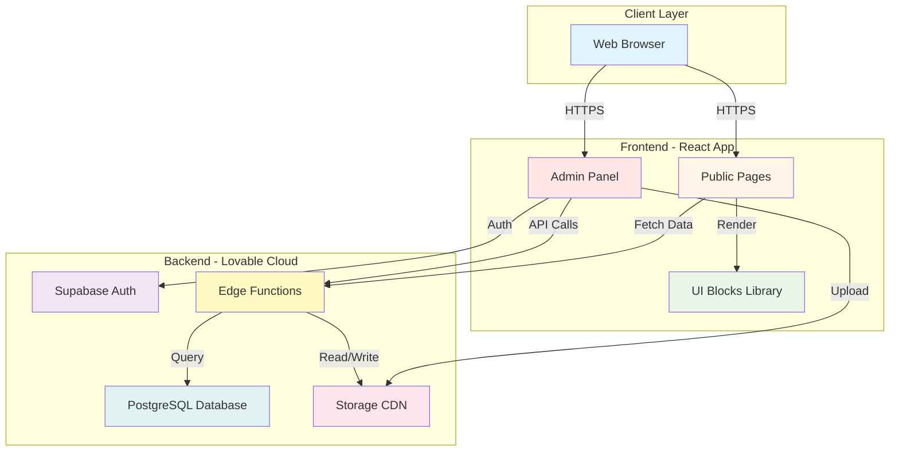
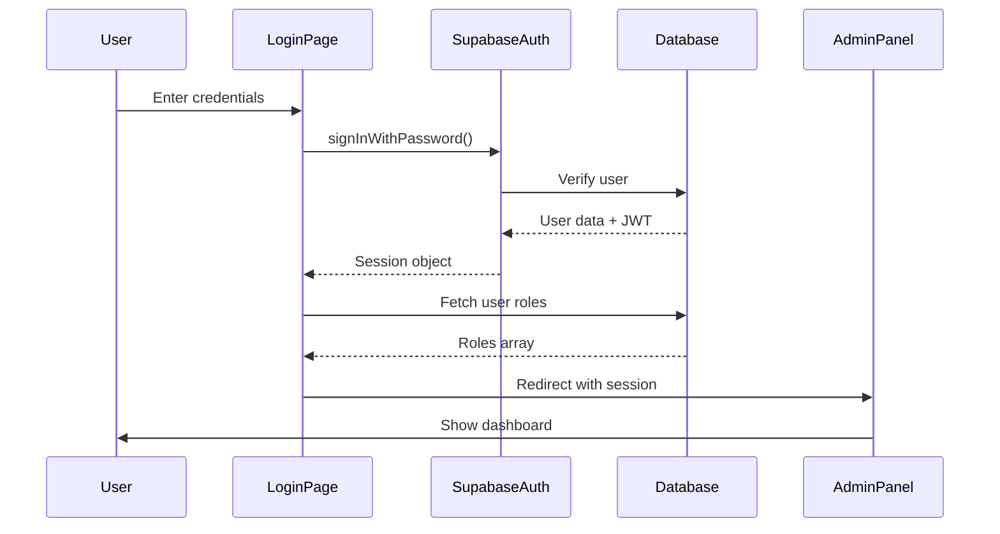
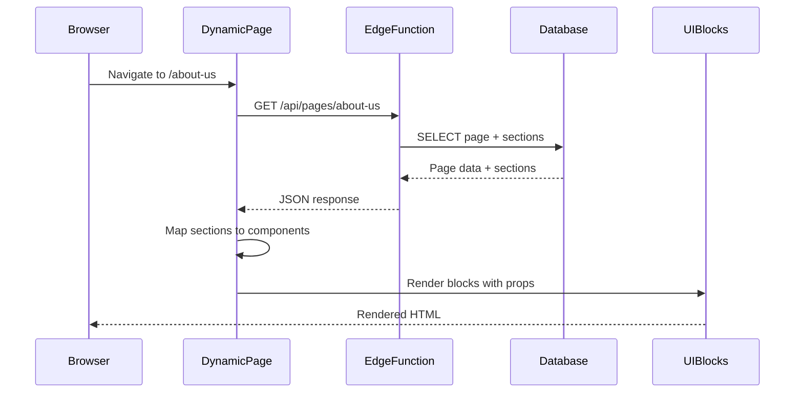
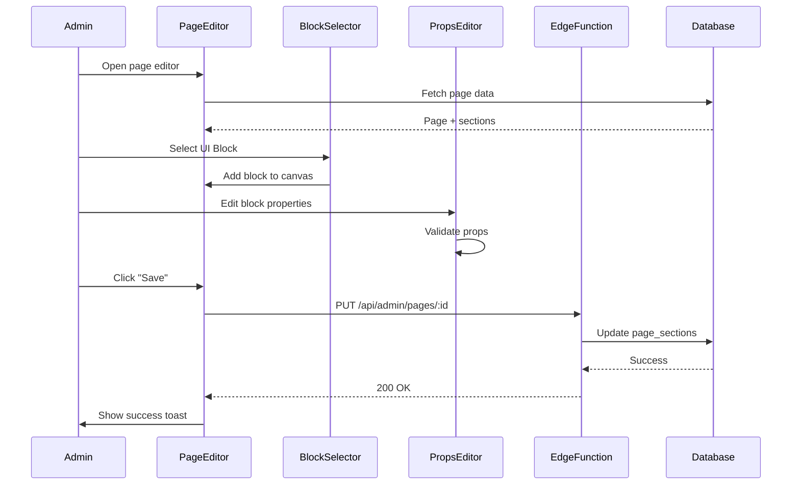
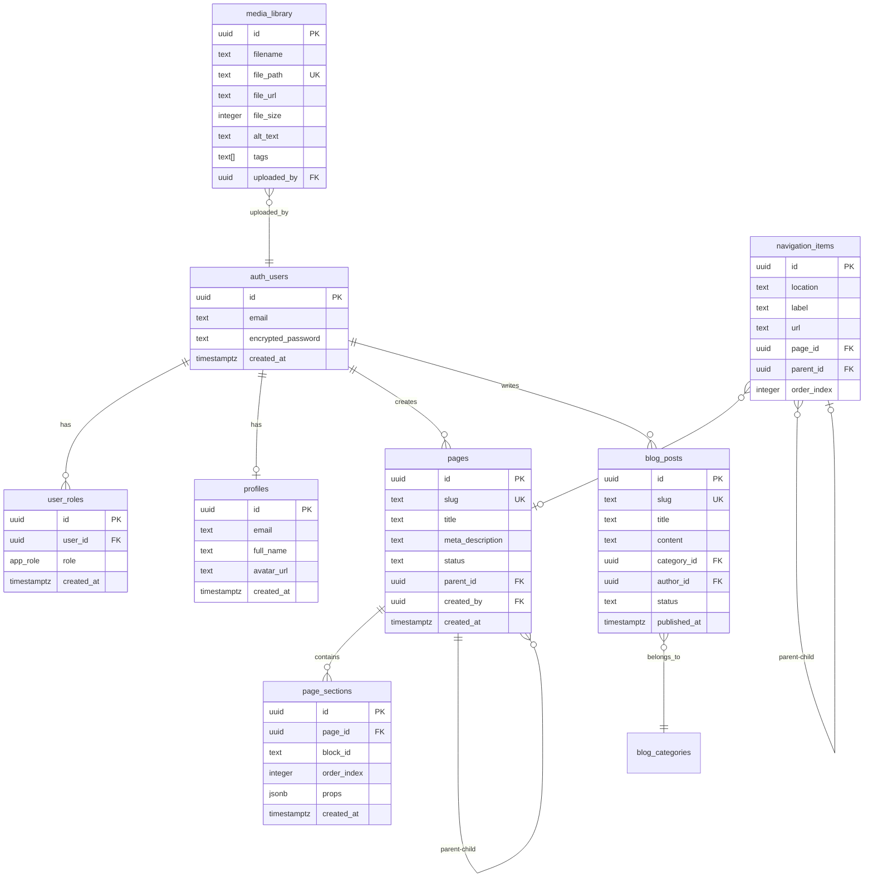
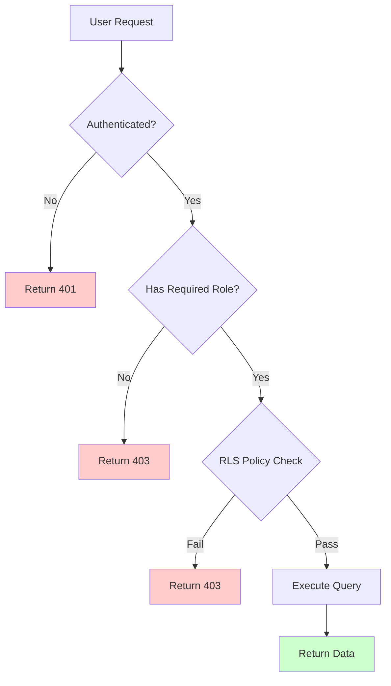
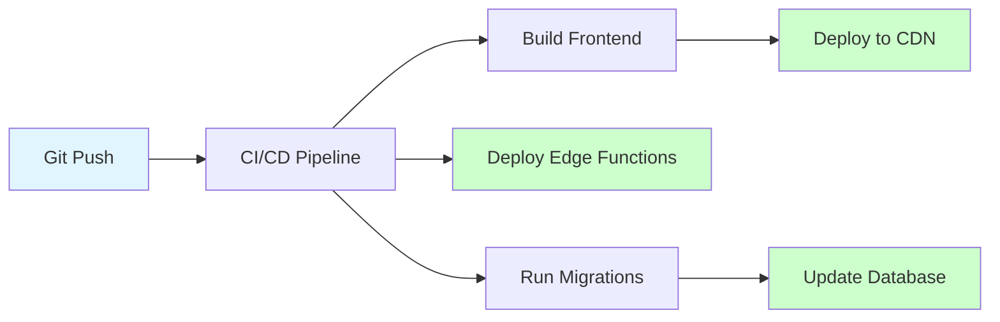
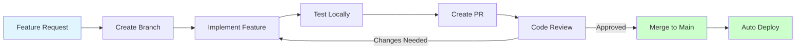

# Devmart Backend - System Architecture

**Version:** 1.0.0  
**Last Updated:** 2025-11-15

---

## 1. Architecture Overview

Devmart is a **full-stack Content Management System (CMS)** built on a modern React frontend with a Lovable Cloud (Supabase) backend. The architecture separates concerns between public-facing frontend pages and an authenticated admin panel.



---

## 2. Technology Stack

### 2.1 Frontend

| Layer | Technology | Version | Purpose |
|-------|-----------|---------|---------|
| Framework | React | 18.3.1 | Component-based UI |
| Build Tool | Vite | Latest | Fast dev server & bundling |
| Routing | React Router DOM | 6.x | Client-side routing |
| Styling | SASS | 1.93.3 | CSS preprocessing |
| UI Components | Radix UI | Latest | Accessible primitives |
| Icons | Iconify + Lucide | Latest | Icon library |
| Forms | React Hook Form | 7.x | Form state management |
| Validation | Zod | 3.x | Schema validation |
| HTTP Client | Axios | 1.13.2 | API requests |
| State Management | React Query | 5.x | Server state caching |

### 2.2 Backend (Lovable Cloud / Supabase)

| Component | Technology | Purpose |
|-----------|-----------|---------|
| Database | PostgreSQL 15 | Relational data storage |
| Authentication | Supabase Auth | User management & JWT |
| Storage | Supabase Storage | File uploads & CDN |
| Functions | Edge Functions (Deno) | Server-side logic |
| Real-time | PostgREST | Auto-generated REST API |
| Security | Row Level Security (RLS) | Database-level authorization |

### 2.3 Development Tools

| Tool | Purpose |
|------|---------|
| Git | Version control |
| ESLint | Code linting |
| Prettier | Code formatting |
| TypeScript | Type checking (optional) |

---

## 3. Application Structure

### 3.1 Directory Structure

```
devmart/
├── public/
│   ├── images/                 # Static images
│   ├── data/                   # Legacy JSON data (to be migrated)
│   └── favicon.ico
├── src/
│   ├── components/
│   │   ├── Admin/             # Admin-specific components
│   │   │   ├── BackendLayout.jsx
│   │   │   ├── AdminSidebar.jsx
│   │   │   ├── AdminTopBar.jsx
│   │   │   ├── DataTable.jsx
│   │   │   ├── BlockSelector.jsx
│   │   │   ├── PageCanvas.jsx
│   │   │   └── BlockPropsEditor.jsx
│   │   ├── Header/            # Public header
│   │   ├── Footer/            # Public footer
│   │   └── Layout/            # Public layouts
│   ├── pages/
│   │   ├── Admin/             # Admin pages
│   │   │   ├── Auth/
│   │   │   │   ├── Login.jsx
│   │   │   │   └── ResetPassword.jsx
│   │   │   ├── Dashboard.jsx
│   │   │   ├── Pages/
│   │   │   │   ├── PagesList.jsx
│   │   │   │   ├── PageEditor.jsx
│   │   │   │   └── PagePreview.jsx
│   │   │   ├── Blog/
│   │   │   ├── Portfolio/
│   │   │   ├── Services/
│   │   │   ├── Team/
│   │   │   ├── FAQs/
│   │   │   ├── Media/
│   │   │   ├── Navigation/
│   │   │   ├── Settings/
│   │   │   ├── Forms/
│   │   │   └── Users/
│   │   ├── Home.jsx           # Public homepage
│   │   ├── DynamicPage.jsx    # Dynamic page renderer
│   │   ├── BlogPost.jsx
│   │   └── ...
│   ├── UIBlocks/              # Reusable UI blocks
│   │   ├── Hero/
│   │   ├── About/
│   │   ├── Services/
│   │   └── ...
│   ├── hooks/
│   │   ├── useAuth.js         # Authentication hook
│   │   ├── usePages.js        # Pages data hook
│   │   └── useMediaLibrary.js
│   ├── utils/
│   │   ├── supabase.js        # Supabase client
│   │   ├── api.js             # API helpers
│   │   └── validation.js      # Validation schemas
│   ├── sass/
│   │   ├── admin/             # Admin styles
│   │   ├── default/           # Zivan variables
│   │   ├── common/            # Shared styles
│   │   └── index.scss
│   └── App.jsx                # Root component
├── supabase/
│   ├── migrations/            # Database migrations
│   ├── functions/             # Edge functions
│   │   ├── pages/
│   │   ├── blog/
│   │   ├── contact-form/
│   │   └── ...
│   └── config.toml            # Supabase config
├── docs/
│   ├── backend/               # Backend documentation
│   └── ...
└── package.json
```

---

## 4. Data Flow

### 4.1 Authentication Flow



### 4.2 Dynamic Page Rendering Flow



### 4.3 Page Builder Flow



---

## 5. Database Architecture

### 5.1 Schema Overview



### 5.2 Row Level Security (RLS)

All tables have RLS enabled. Security is enforced at the database level, not just the application level.

**Key RLS Patterns:**

1. **User Roles Verification:**
   ```sql
   -- Using security definer function to avoid recursion
   public.has_role(auth.uid(), 'admin')
   ```

2. **Public Read Access:**
   ```sql
   -- Anonymous users can view published content
   status = 'published'
   ```

3. **Admin Full Access:**
   ```sql
   -- Admins can do everything
   public.has_role(auth.uid(), 'admin') OR 
   public.has_role(auth.uid(), 'super_admin')
   ```

4. **Creator Access:**
   ```sql
   -- Users can edit their own content
   created_by = auth.uid()
   ```

---

## 6. API Architecture

### 6.1 Edge Functions Structure

```
supabase/functions/
├── pages/
│   └── index.ts               # GET /pages/:slug
├── admin-pages/
│   └── index.ts               # CRUD /admin/pages
├── admin-pages-sections/
│   └── index.ts               # CRUD /admin/pages/:id/sections
├── blog/
│   └── index.ts               # GET /blog, GET /blog/:slug
├── admin-blog/
│   └── index.ts               # CRUD /admin/blog
├── contact-form/
│   └── index.ts               # POST /contact-form
├── admin-forms/
│   └── index.ts               # GET /admin/forms
└── ...
```

### 6.2 API Endpoint Conventions

| Method | Pattern | Purpose | Auth |
|--------|---------|---------|------|
| GET | `/api/:resource` | List resources | Public/Admin |
| GET | `/api/:resource/:id` | Get single resource | Public/Admin |
| POST | `/api/admin/:resource` | Create resource | Admin |
| PUT | `/api/admin/:resource/:id` | Update resource | Admin |
| DELETE | `/api/admin/:resource/:id` | Delete resource | Admin |

### 6.3 Request/Response Format

**Standard Success Response:**
```json
{
  "success": true,
  "data": {
    "id": "uuid",
    "title": "Example"
  }
}
```

**Standard Error Response:**
```json
{
  "success": false,
  "error": {
    "code": "VALIDATION_ERROR",
    "message": "Invalid input",
    "details": {
      "slug": "Slug must be lowercase"
    }
  }
}
```

---

## 7. Security Architecture

### 7.1 Authentication

- **Method:** Email/password via Supabase Auth
- **Token:** JWT with 7-day expiration
- **Storage:** HTTP-only cookies (production)
- **Refresh:** Automatic token refresh via Supabase client

### 7.2 Authorization



### 7.3 Input Validation

All inputs validated using **Zod schemas**:

```javascript
import { z } from 'zod';

const pageSchema = z.object({
  slug: z.string().min(1).max(100).regex(/^[a-z0-9-]+$/),
  title: z.string().min(1).max(200),
  meta_description: z.string().max(160).optional(),
  status: z.enum(['draft', 'published']),
});
```

### 7.4 Rate Limiting

- Auth endpoints: 5 requests / 15 minutes per IP
- Contact form: 3 requests / hour per IP
- Media uploads: 50 uploads / hour per user
- API endpoints: 100 requests / minute per user

---

## 8. Performance Architecture

### 8.1 Caching Strategy

| Layer | Cache Type | TTL | Invalidation |
|-------|-----------|-----|--------------|
| Database | Query cache | 5 min | On update |
| API | Response cache | 5 min | On mutation |
| CDN | Asset cache | 1 year | Cache-busting |
| Client | React Query | 5 min | Manual/Auto |

### 8.2 Optimization Techniques

1. **Database Indexes:**
   - All foreign keys
   - Frequently queried columns (slug, status)
   - Text search columns

2. **Image Optimization:**
   - Automatic WebP conversion
   - Responsive image sizes
   - Lazy loading with Intersection Observer

3. **Code Splitting:**
   - Lazy load admin routes
   - Dynamic imports for UI Blocks

4. **Asset Optimization:**
   - Minified JS/CSS
   - Tree-shaking unused code
   - Gzip compression

---

## 9. Deployment Architecture

### 9.1 Production Deployment



### 9.2 Environment Configuration

| Environment | Frontend URL | Backend URL | Database |
|-------------|-------------|-------------|----------|
| Development | localhost:5173 | Local Supabase | Local DB |
| Staging | staging.devmart.com | Staging Cloud | Staging DB |
| Production | devmart.com | Prod Cloud | Prod DB |

---

## 10. Monitoring & Logging

### 10.1 Logging Points

- Authentication events (login, logout, failures)
- Database mutations (who changed what, when)
- API errors (400/500 responses)
- Security events (failed auth, permission denied)
- Performance metrics (slow queries)

### 10.2 Monitoring Metrics

- Page load times
- API response times
- Database query times
- Error rates
- Active user sessions
- Storage usage

---

## 11. Scalability Considerations

### 11.1 Current Capacity

- Database: Handles 100k+ rows efficiently
- Storage: Unlimited (Supabase CDN)
- Concurrent users: 1000+ simultaneous
- API requests: 100 req/s without optimization

### 11.2 Future Scaling

- **Database:** Add read replicas for analytics
- **CDN:** CloudFlare in front of Supabase CDN
- **Caching:** Redis for session storage
- **Functions:** Increase function instances

---

## 12. Disaster Recovery

### 12.1 Backup Strategy

- Database: Daily automated backups (7-day retention)
- Storage: Versioned files with S3 backup
- Code: Git repository with tags

### 12.2 Recovery Procedures

1. Database corruption: Restore from latest backup
2. Accidental deletion: Recover from soft-delete table
3. Code regression: Revert to previous Git tag

---

## 13. Development Workflow



---

## 14. Integration Points

### 14.1 Current Integrations

- **Iconify:** Icon library
- **Radix UI:** Accessible components
- **React Query:** Data fetching
- **Zod:** Validation

### 14.2 Future Integrations

- **Email:** Hostinger SMTP for transactional emails (configured in Settings)
- **Analytics:** Google Analytics / Plausible
- **Search:** Algolia for full-text search
- **Payments:** Stripe for e-commerce
- **CDN:** CloudFlare for additional caching

---

**End of Architecture Document**
