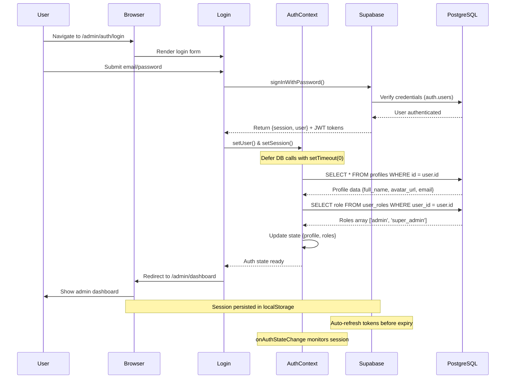
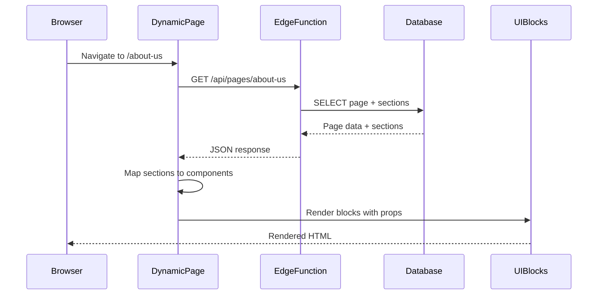
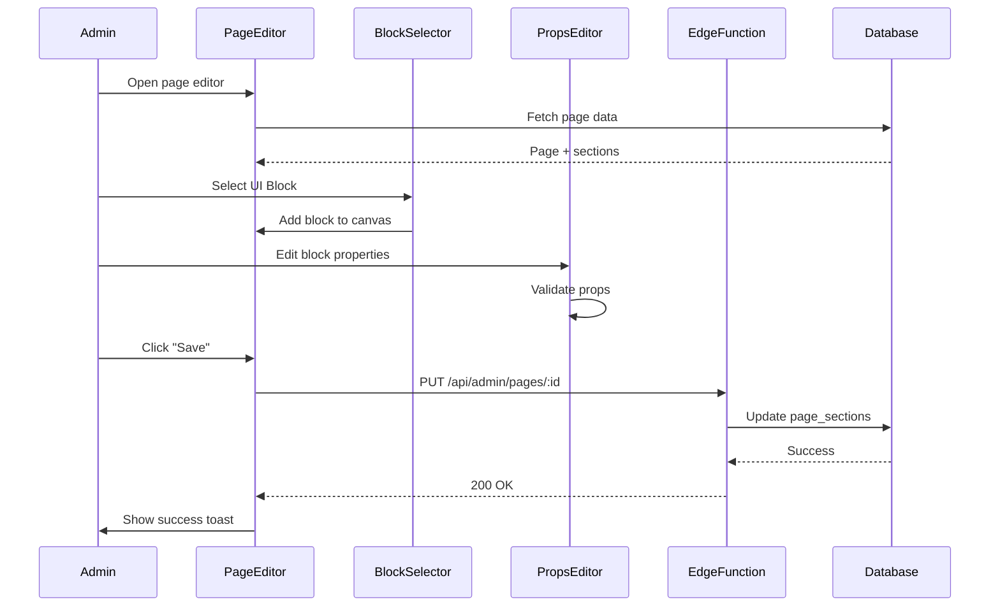
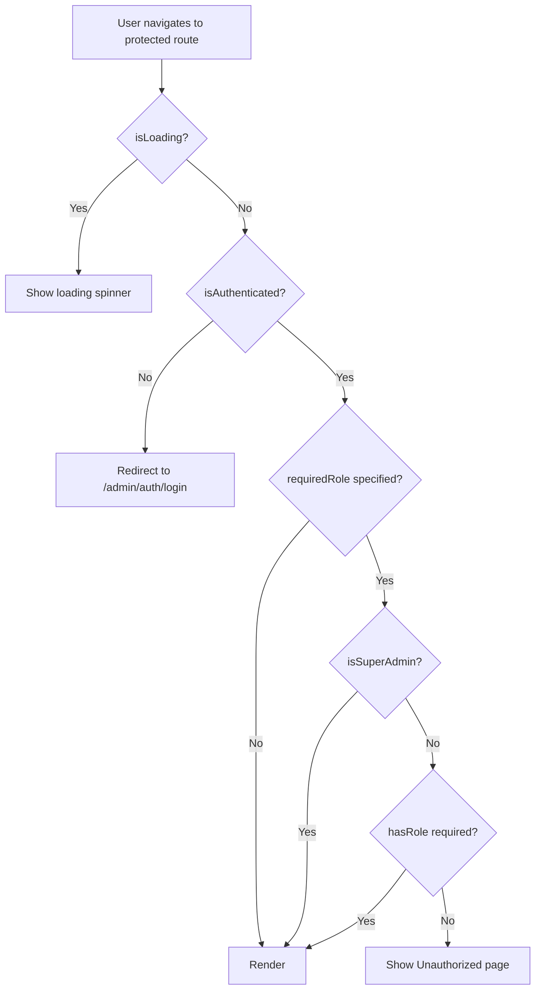
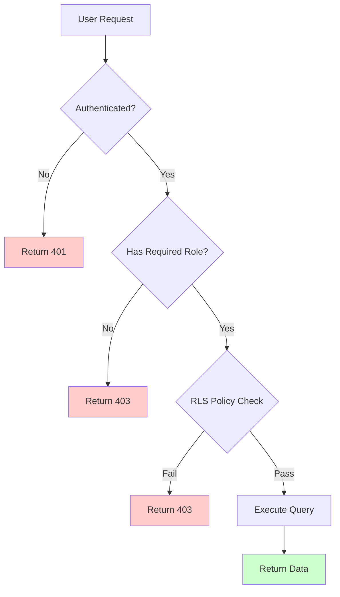
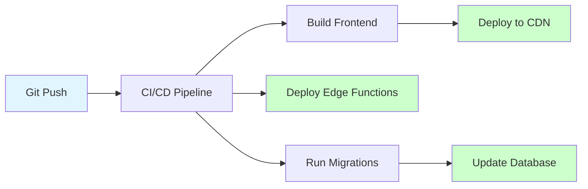
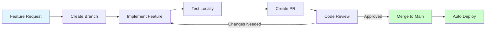

# Devmart Backend - System Architecture

**Version:** 1.0.0  
**Last Updated:** 2025-11-15

---

## 1. Architecture Overview

Devmart is a **full-stack Content Management System (CMS)** built on a modern React frontend with a Supabase backend. The architecture separates concerns between public-facing frontend pages and an authenticated admin panel. The system is designed for future deployment on Hostinger VPS.


---

## 2. Technology Stack

### 2.1 Frontend

| Layer | Technology | Version | Purpose |
|-------|-----------|---------|---------|
| Framework | React | 18.3.1 | Component-based UI |
| Build Tool | Vite | Latest | Fast dev server & bundling |
| Routing | React Router DOM | 6.x | Client-side routing |
| Styling | SASS | 1.93.3 | CSS preprocessing |
| UI Components | Radix UI | Latest | Accessible primitives |
| Icons | Iconify + Lucide | Latest | Icon library |
| Forms | React Hook Form | 7.x | Form state management |
| Validation | Zod | 3.x | Schema validation |
| HTTP Client | Axios | 1.13.2 | API requests |
| State Management | React Query | 5.x | Server state caching |

### 2.2 Backend (Supabase)

| Component | Technology | Purpose |
|-----------|-----------|---------|
| Database | PostgreSQL 15 | Relational data storage |
| Authentication | Supabase Auth | User management & JWT |
| Storage | Supabase Storage | File uploads & CDN |
| Functions | Edge Functions (Deno) | Server-side logic |
| Real-time | PostgREST | Auto-generated REST API |
| Security | Row Level Security (RLS) | Database-level authorization |
| Email | Hostinger SMTP | Transactional emails (configured in Settings) |

### 2.3 Development Tools

| Tool | Purpose |
|------|---------|
| Git | Version control |
| ESLint | Code linting |
| Prettier | Code formatting |
| TypeScript | Type checking (optional) |

---

## 3. Application Structure

### 3.1 Directory Structure

```
devmart/
├── public/
│   ├── images/                 # Static images
│   ├── data/                   # Legacy JSON data (to be migrated)
│   └── favicon.ico
├── src/
│   ├── components/
│   │   ├── Admin/             # Admin-specific components
│   │   │   ├── BackendLayout.jsx
│   │   │   ├── AdminSidebar.jsx
│   │   │   ├── AdminTopBar.jsx
│   │   │   ├── DataTable.jsx
│   │   │   ├── BlockSelector.jsx
│   │   │   ├── PageCanvas.jsx
│   │   │   └── BlockPropsEditor.jsx
│   │   ├── Header/            # Public header
│   │   ├── Footer/            # Public footer
│   │   └── Layout/            # Public layouts
│   ├── pages/
│   │   ├── Admin/             # Admin pages
│   │   │   ├── Auth/
│   │   │   │   ├── Login.jsx
│   │   │   │   └── ResetPassword.jsx
│   │   │   ├── Dashboard.jsx
│   │   │   ├── Pages/
│   │   │   │   ├── PagesList.jsx
│   │   │   │   ├── PageEditor.jsx
│   │   │   │   └── PagePreview.jsx
│   │   │   ├── Blog/
│   │   │   ├── Portfolio/
│   │   │   ├── Services/
│   │   │   ├── Team/
│   │   │   ├── FAQs/
│   │   │   ├── Media/
│   │   │   ├── Navigation/
│   │   │   ├── Settings/
│   │   │   ├── Forms/
│   │   │   └── Users/
│   │   ├── Home.jsx           # Public homepage
│   │   ├── DynamicPage.jsx    # Dynamic page renderer
│   │   ├── BlogPost.jsx
│   │   └── ...
│   ├── UIBlocks/              # Reusable UI blocks
│   │   ├── Hero/
│   │   ├── About/
│   │   ├── Services/
│   │   └── ...
│   ├── hooks/
│   │   ├── useAuth.js         # Authentication hook
│   │   ├── usePages.js        # Pages data hook
│   │   └── useMediaLibrary.js
│   ├── utils/
│   │   ├── supabase.js        # Supabase client
│   │   ├── api.js             # API helpers
│   │   └── validation.js      # Validation schemas
│   ├── sass/
│   │   ├── admin/             # Admin styles
│   │   ├── default/           # Zivan variables
│   │   ├── common/            # Shared styles
│   │   └── index.scss
│   └── App.jsx                # Root component
├── supabase/
│   ├── migrations/            # Database migrations
│   ├── functions/             # Edge functions
│   │   ├── pages/
│   │   ├── blog/
│   │   ├── contact-form/
│   │   └── ...
│   └── config.toml            # Supabase config
├── docs/
│   ├── backend/               # Backend documentation
│   └── ...
└── package.json
```

---

## 4. Data Flow

### 4.1 Authentication Flow (Phase 4 - Implemented)



### 4.2 Dynamic Page Rendering Flow



### 4.3 Page Builder Flow



---

## 4.4 Authentication Architecture (Phase 4 - Implemented)

### AuthContext Provider

**Location:** `/src/contexts/AuthContext.jsx`

**Purpose:** Centralized authentication state management for the entire application.

**State Structure:**
```javascript
{
  user: User | null,              // Supabase auth.users object
  session: Session | null,        // JWT session with access/refresh tokens
  profile: Profile | null,        // User profile from profiles table
  roles: string[],                // Array of user roles
  isLoading: boolean,             // Auth initialization status
  isAuthenticated: boolean        // Computed: !!user
}
```

**Exposed Methods:**
```javascript
{
  login: (email, password) => Promise,
  logout: () => Promise,
  hasRole: (role) => boolean,
  isSuperAdmin: () => boolean,
  isAdmin: () => boolean
}
```

**Implementation Pattern:**

```javascript
// Step 1: Set up listener FIRST (prevents missing events)
const { data: { subscription } } = supabase.auth.onAuthStateChange(
  (event, session) => {
    setSession(session);
    setUser(session?.user ?? null);
    
    if (session?.user) {
      // Defer DB calls to prevent deadlock
      setTimeout(() => {
        fetchUserProfile(session.user.id);
        fetchUserRoles(session.user.id);
      }, 0);
    }
  }
);

// Step 2: Check existing session AFTER listener setup
supabase.auth.getSession().then(({ data: { session } }) => {
  setSession(session);
  setUser(session?.user ?? null);
  // ... handle profile/roles
  setIsLoading(false);
});
```

**Critical Implementation Notes:**
- ⚠️ Always defer profile/role fetching with `setTimeout(0)` to avoid deadlock
- ⚠️ Set up `onAuthStateChange` listener before calling `getSession()`
- ⚠️ Store complete session object, not just user (needed for token refresh)
- ⚠️ Never call Supabase functions directly inside `onAuthStateChange` callback

### Protected Route System

**ProtectedRoute Component:** `/src/components/Admin/ProtectedRoute.jsx`



**AuthRoute Component:** `/src/components/Admin/AuthRoute.jsx`
- Prevents authenticated users from accessing login pages
- Redirects to dashboard if already logged in

**Route Configuration:**
```jsx
// App.jsx route structure
<Route element={<ProtectedRoute />}>
  <Route path="/admin/dashboard" element={<Dashboard />} />
</Route>

<Route element={<ProtectedRoute requiredRole="super_admin" />}>
  <Route path="/admin/users" element={<UsersList />} />
</Route>

<Route element={<AuthRoute />}>
  <Route path="/admin/auth/login" element={<Login />} />
  <Route path="/admin/auth/reset-password" element={<ResetPassword />} />
</Route>
```

### Session Management

**Token Storage:**
- Access token: Short-lived JWT (~1 hour)
- Refresh token: Long-lived, stored securely
- Storage: localStorage via Supabase client
- Auto-refresh: Handled automatically by Supabase

**Supabase Client Configuration:**
```typescript
// src/integrations/supabase/client.ts (auto-configured)
export const supabase = createClient(SUPABASE_URL, SUPABASE_KEY, {
  auth: {
    storage: localStorage,
    persistSession: true,
    autoRefreshToken: true
  }
});
```

**Session Lifecycle:**
1. User logs in → Session created
2. Tokens stored in localStorage
3. Page refresh → Session restored from localStorage
4. Token expiry approaching → Auto-refresh triggered
5. Logout → Session cleared

### Role Hierarchy & Permissions

```
super_admin
├─ Full system access
├─ Bypasses all role checks
├─ User management (add/remove roles)
├─ Cannot remove own super_admin role (safety)
└─ Access to all modules

admin
├─ Content management
├─ Page builder access
├─ View all user profiles
└─ Cannot manage user roles

moderator
├─ Content approval
├─ Basic editing rights
└─ Limited admin access

user
└─ Standard user privileges
```

---

## 5. Database Architecture

### 5.1 Schema Overview

**Current Implementation Status:**
- ✅ **Authentication Tables** (Phase 4 - Implemented)
  - `profiles` - User profile information
  - `user_roles` - Role-based access control
- 📋 **Content Tables** (Planned - Future Phases)
  - `pages`, `page_sections`, `blog_posts`, `media_library`, `navigation_items`

```mermaid
erDiagram
    auth_users ||--o| profiles : "has profile"
    auth_users ||--o{ user_roles : "has roles"
    auth_users ||--o{ pages : "creates"
    auth_users ||--o{ blog_posts : "writes"
    
    pages ||--o{ page_sections : "contains"
    pages ||--o{ pages : "parent-child"
    
    blog_posts }o--|| blog_categories : "belongs to"
    
    media_library }o--|| auth_users : "uploaded by"
    
    navigation_items }o--o| pages : "links to"
    navigation_items }o--o| navigation_items : "parent-child"
    
    auth_users {
        uuid id PK "Managed by Supabase"
        text email "Unique identifier"
        text encrypted_password "Hashed password"
        timestamptz created_at "Registration date"
    }
    
    profiles {
        uuid id PK "FK to auth.users.id"
        text email "Synced from auth.users"
        text full_name "Display name"
        text avatar_url "Profile picture URL"
        timestamptz created_at "Profile creation"
        timestamptz updated_at "Last modified"
    }
    
    user_roles {
        uuid id PK "Auto-generated UUID"
        uuid user_id FK "FK to auth.users.id"
        app_role role "Enum: user, moderator, admin, super_admin"
        timestamptz created_at "Role assignment date"
    }
        timestamptz created_at
    }
    
    pages {
        uuid id PK
        text slug UK
        text title
        text meta_description
        text status
        uuid parent_id FK
        uuid created_by FK
        timestamptz created_at
    }
    
    page_sections {
        uuid id PK
        uuid page_id FK
        text block_id
        integer order_index
        jsonb props
        timestamptz created_at
    }
    
    blog_posts {
        uuid id PK
        text slug UK
        text title
        text content
        uuid category_id FK
        uuid author_id FK
        text status
        timestamptz published_at
    }
    
    media_library {
        uuid id PK
        text filename
        text file_path UK
        text file_url
        integer file_size
        text alt_text
        text[] tags
        uuid uploaded_by FK
    }
    
    navigation_items {
        uuid id PK
        text location
        text label
        text url
        uuid page_id FK
        uuid parent_id FK
        integer order_index
    }
```

### 5.2 Row Level Security (RLS) - Phase 4 Implementation

All authentication tables have RLS enabled. Security is enforced at the database level, not just the application level.

#### Implemented RLS Policies

**profiles Table:**

```sql
-- Policy 1: Users can view their own profile
CREATE POLICY "Users can view their own profile"
ON profiles FOR SELECT
USING (auth.uid() = id);

-- Policy 2: Users can update their own profile
CREATE POLICY "Users can update their own profile"
ON profiles FOR UPDATE
USING (auth.uid() = id);

-- Policy 3: Admins can view all profiles
CREATE POLICY "Admins can view all profiles"
ON profiles FOR SELECT
USING (
  has_role(auth.uid(), 'admin'::app_role) OR 
  has_role(auth.uid(), 'super_admin'::app_role)
);

-- Policy 4: Super admins can manage all profiles
CREATE POLICY "Super admins can manage all profiles"
ON profiles FOR ALL
USING (has_role(auth.uid(), 'super_admin'::app_role));
```

**user_roles Table:**

```sql
-- Policy 1: Users can view their own roles
CREATE POLICY "Users can view their own roles"
ON user_roles FOR SELECT
USING (auth.uid() = user_id);

-- Policy 2: Super admins can manage all roles
CREATE POLICY "Super admins can manage all roles"
ON user_roles FOR ALL
USING (has_role(auth.uid(), 'super_admin'::app_role));
```

#### Security Definer Function

**Purpose:** Prevents recursive RLS policy evaluation when checking roles.

```sql
CREATE OR REPLACE FUNCTION public.has_role(_user_id UUID, _role app_role)
RETURNS BOOLEAN
LANGUAGE SQL
STABLE SECURITY DEFINER
SET search_path = public
AS $$
  SELECT EXISTS (
    SELECT 1
    FROM public.user_roles
    WHERE user_id = _user_id AND role = _role
  )
$$;
```

**Why SECURITY DEFINER?**
- Executes with function owner's privileges
- Bypasses RLS on `user_roles` table
- Prevents infinite recursion in RLS policies
- Allows safe role checking within policies

#### Database Triggers

**Auto-create Profile on User Signup:**

```sql
CREATE OR REPLACE FUNCTION public.handle_new_user()
RETURNS TRIGGER
LANGUAGE plpgsql
SECURITY DEFINER
SET search_path = public
AS $$
BEGIN
  INSERT INTO public.profiles (id, email, full_name, avatar_url)
  VALUES (
    NEW.id,
    NEW.email,
    NEW.raw_user_meta_data->>'full_name',
    NEW.raw_user_meta_data->>'avatar_url'
  );
  RETURN NEW;
END;
$$;

CREATE TRIGGER on_auth_user_created
  AFTER INSERT ON auth.users
  FOR EACH ROW
  EXECUTE FUNCTION public.handle_new_user();
```

**Key RLS Patterns Used:**

1. **Self-Access Pattern:**
   ```sql
   auth.uid() = id  -- User can access their own data
   ```

2. **Role Verification Pattern:**
   ```sql
   has_role(auth.uid(), 'admin')  -- Check if user has role
   ```

3. **Admin Full Access Pattern:**
   ```sql
   has_role(auth.uid(), 'super_admin')  -- Super admin bypasses restrictions
   ```

4. **Multiple Role Check:**
   ```sql
   has_role(auth.uid(), 'admin') OR has_role(auth.uid(), 'super_admin')
   ```

---

## 6. API Architecture

### 6.1 Edge Functions Structure

```
supabase/functions/
├── pages/
│   └── index.ts               # GET /pages/:slug
├── admin-pages/
│   └── index.ts               # CRUD /admin/pages
├── admin-pages-sections/
│   └── index.ts               # CRUD /admin/pages/:id/sections
├── blog/
│   └── index.ts               # GET /blog, GET /blog/:slug
├── admin-blog/
│   └── index.ts               # CRUD /admin/blog
├── contact-form/
│   └── index.ts               # POST /contact-form
├── admin-forms/
│   └── index.ts               # GET /admin/forms
└── ...
```

### 6.2 API Endpoint Conventions

| Method | Pattern | Purpose | Auth |
|--------|---------|---------|------|
| GET | `/api/:resource` | List resources | Public/Admin |
| GET | `/api/:resource/:id` | Get single resource | Public/Admin |
| POST | `/api/admin/:resource` | Create resource | Admin |
| PUT | `/api/admin/:resource/:id` | Update resource | Admin |
| DELETE | `/api/admin/:resource/:id` | Delete resource | Admin |

### 6.3 Request/Response Format

**Standard Success Response:**
```json
{
  "success": true,
  "data": {
    "id": "uuid",
    "title": "Example"
  }
}
```

**Standard Error Response:**
```json
{
  "success": false,
  "error": {
    "code": "VALIDATION_ERROR",
    "message": "Invalid input",
    "details": {
      "slug": "Slug must be lowercase"
    }
  }
}
```

---

## 7. Security Architecture

### 7.1 Authentication

- **Method:** Email/password via Supabase Auth
- **Token:** JWT with 7-day expiration
- **Storage:** HTTP-only cookies (production)
- **Refresh:** Automatic token refresh via Supabase client

### 7.2 Authorization



### 7.3 Input Validation

All inputs validated using **Zod schemas**:

```javascript
import { z } from 'zod';

const pageSchema = z.object({
  slug: z.string().min(1).max(100).regex(/^[a-z0-9-]+$/),
  title: z.string().min(1).max(200),
  meta_description: z.string().max(160).optional(),
  status: z.enum(['draft', 'published']),
});
```

### 7.4 Rate Limiting

- Auth endpoints: 5 requests / 15 minutes per IP
- Contact form: 3 requests / hour per IP
- Media uploads: 50 uploads / hour per user
- API endpoints: 100 requests / minute per user

---

## 8. Performance Architecture

### 8.1 Caching Strategy

| Layer | Cache Type | TTL | Invalidation |
|-------|-----------|-----|--------------|
| Database | Query cache | 5 min | On update |
| API | Response cache | 5 min | On mutation |
| CDN | Asset cache | 1 year | Cache-busting |
| Client | React Query | 5 min | Manual/Auto |

### 8.2 Optimization Techniques

1. **Database Indexes:**
   - All foreign keys
   - Frequently queried columns (slug, status)
   - Text search columns

2. **Image Optimization:**
   - Automatic WebP conversion
   - Responsive image sizes
   - Lazy loading with Intersection Observer

3. **Code Splitting:**
   - Lazy load admin routes
   - Dynamic imports for UI Blocks

4. **Asset Optimization:**
   - Minified JS/CSS
   - Tree-shaking unused code
   - Gzip compression

---

## 9. Deployment Architecture

### 9.1 Production Deployment



### 9.2 Environment Configuration

| Environment | Frontend URL | Backend URL | Database |
|-------------|-------------|-------------|----------|
| Development | localhost:5173 | Local Supabase | Local DB |
| Staging | staging.devmart.com | Staging Cloud | Staging DB |
| Production | devmart.com | Prod Cloud | Prod DB |

---

## 10. Monitoring & Logging

### 10.1 Logging Points

- Authentication events (login, logout, failures)
- Database mutations (who changed what, when)
- API errors (400/500 responses)
- Security events (failed auth, permission denied)
- Performance metrics (slow queries)

### 10.2 Monitoring Metrics

- Page load times
- API response times
- Database query times
- Error rates
- Active user sessions
- Storage usage

---

## 11. Scalability Considerations

### 11.1 Current Capacity

- Database: Handles 100k+ rows efficiently
- Storage: Unlimited (Supabase CDN)
- Concurrent users: 1000+ simultaneous
- API requests: 100 req/s without optimization

### 11.2 Future Scaling

- **Database:** Add read replicas for analytics
- **CDN:** CloudFlare in front of Supabase CDN
- **Caching:** Redis for session storage
- **Functions:** Increase function instances

---

## 12. Disaster Recovery

### 12.1 Backup Strategy

- Database: Daily automated backups (7-day retention)
- Storage: Versioned files with S3 backup
- Code: Git repository with tags

### 12.2 Recovery Procedures

1. Database corruption: Restore from latest backup
2. Accidental deletion: Recover from soft-delete table
3. Code regression: Revert to previous Git tag

---

## 13. Development Workflow



---

## 14. Integration Points

### 14.1 Current Integrations

- **Iconify:** Icon library
- **Radix UI:** Accessible components
- **React Query:** Data fetching
- **Zod:** Validation

### 14.2 Future Integrations

- **Email:** Hostinger SMTP for transactional emails (configured in Settings)
- **Analytics:** Google Analytics / Plausible
- **Search:** Algolia for full-text search
- **Payments:** Stripe for e-commerce
- **CDN:** CloudFlare for additional caching

---

**End of Architecture Document**
