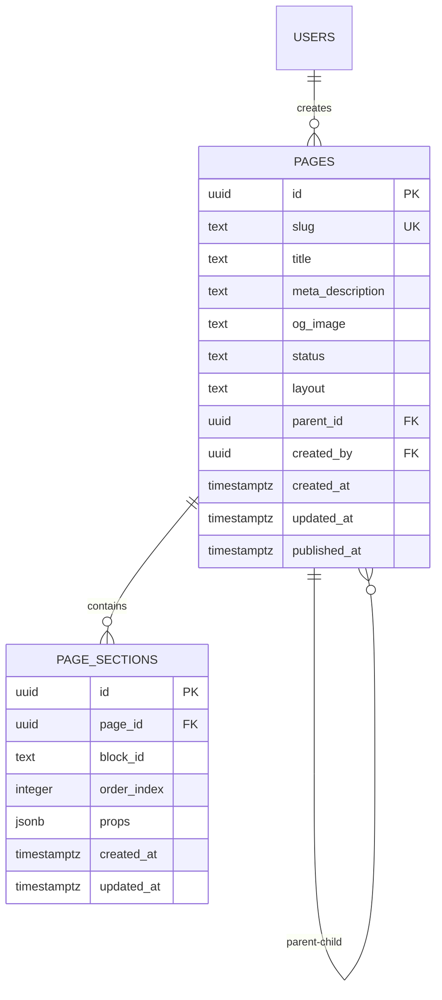

# Devmart Backend - Pages Module (UI Block Integration)

**Version:** 1.0.0  
**Last Updated:** 2025-11-15  
**Status:** CRITICAL - Priority #1

---

## 1. Overview

The **Pages Module** is the heart of Devmart's CMS capabilities. It enables non-technical users to:
- Create custom pages dynamically
- Select from 36 pre-built UI Blocks
- Arrange blocks in any order
- Customize block properties
- Publish/unpublish pages
- Preview pages before publishing

This module transforms Devmart from a static template into a **dynamic page builder**.

---

## 2. Architecture

### 2.1 Data Model



### 2.2 UI Block Registry

The `src/UIBlocks/ui-blocks-registry.json` file contains metadata for all 36 UI Blocks:

```json
{
  "sections": {
    "Hero": {
      "blocks": [
        {
          "id": "Hero1_CreativeAgency",
          "name": "Hero 1 - Creative Agency",
          "component": "Hero1_CreativeAgency",
          "description": "Text animation with video modal",
          "theme": "both",
          "tags": ["hero", "video", "animation"],
          "usedIn": ["Creative Agency"],
          "props": {
            "title": { "type": "string", "required": true },
            "subtitle": { "type": "string", "required": false },
            "videoUrl": { "type": "string", "required": false },
            "bgImage": { "type": "string", "required": false }
          }
        }
      ]
    }
  }
}
```

---

## 3. Backend Implementation

### 3.1 Database Tables

#### pages table
```sql
CREATE TABLE public.pages (
  id UUID PRIMARY KEY DEFAULT gen_random_uuid(),
  slug TEXT UNIQUE NOT NULL,
  title TEXT NOT NULL,
  meta_description TEXT,
  og_image TEXT,
  status TEXT DEFAULT 'draft' CHECK (status IN ('draft', 'published')),
  layout TEXT DEFAULT 'Layout', -- Layout, Layout2, Layout3
  parent_id UUID REFERENCES public.pages(id) ON DELETE SET NULL,
  created_at TIMESTAMPTZ DEFAULT NOW(),
  updated_at TIMESTAMPTZ DEFAULT NOW(),
  created_by UUID REFERENCES auth.users(id),
  published_at TIMESTAMPTZ
);

CREATE INDEX idx_pages_slug ON public.pages(slug);
CREATE INDEX idx_pages_status ON public.pages(status);
CREATE INDEX idx_pages_created_by ON public.pages(created_by);
```

#### page_sections table
```sql
CREATE TABLE public.page_sections (
  id UUID PRIMARY KEY DEFAULT gen_random_uuid(),
  page_id UUID REFERENCES public.pages(id) ON DELETE CASCADE NOT NULL,
  block_id TEXT NOT NULL, -- e.g., 'Hero1_CreativeAgency'
  order_index INTEGER NOT NULL,
  props JSONB DEFAULT '{}', -- Block-specific props
  created_at TIMESTAMPTZ DEFAULT NOW(),
  updated_at TIMESTAMPTZ DEFAULT NOW(),
  UNIQUE(page_id, order_index)
);

CREATE INDEX idx_page_sections_page_id ON public.page_sections(page_id);
CREATE INDEX idx_page_sections_order ON public.page_sections(page_id, order_index);
```

### 3.2 Row Level Security (RLS)

```sql
-- Enable RLS
ALTER TABLE public.pages ENABLE ROW LEVEL SECURITY;
ALTER TABLE public.page_sections ENABLE ROW LEVEL SECURITY;

-- Admins and editors can manage pages
CREATE POLICY "Admins manage pages"
ON public.pages FOR ALL
TO authenticated
USING (
  public.has_role(auth.uid(), 'super_admin') OR
  public.has_role(auth.uid(), 'admin') OR
  public.has_role(auth.uid(), 'editor')
);

-- Everyone can view published pages
CREATE POLICY "Public view published pages"
ON public.pages FOR SELECT
TO anon, authenticated
USING (status = 'published');

-- Admins manage page sections
CREATE POLICY "Admins manage page sections"
ON public.page_sections FOR ALL
TO authenticated
USING (
  public.has_role(auth.uid(), 'super_admin') OR
  public.has_role(auth.uid(), 'admin') OR
  public.has_role(auth.uid(), 'editor')
);

-- Public can view published page sections
CREATE POLICY "Public view published page sections"
ON public.page_sections FOR SELECT
TO anon, authenticated
USING (
  EXISTS (
    SELECT 1 FROM public.pages
    WHERE id = page_sections.page_id AND status = 'published'
  )
);
```

---

## 4. Edge Functions (API)

### 4.1 GET /api/pages/:slug

Fetch page data for frontend rendering.

```typescript
// supabase/functions/pages/index.ts
import { serve } from 'https://deno.land/std@0.168.0/http/server.ts'
import { createClient } from 'https://esm.sh/@supabase/supabase-js@2'

const corsHeaders = {
  'Access-Control-Allow-Origin': '*',
  'Access-Control-Allow-Headers': 'authorization, x-client-info, apikey, content-type',
}

serve(async (req) => {
  if (req.method === 'OPTIONS') {
    return new Response(null, { headers: corsHeaders })
  }

  try {
    const url = new URL(req.url)
    const slug = url.pathname.split('/').pop()

    const supabase = createClient(
      Deno.env.get('SUPABASE_URL') ?? '',
      Deno.env.get('SUPABASE_ANON_KEY') ?? ''
    )

    // Fetch page with sections
    const { data: page, error: pageError } = await supabase
      .from('pages')
      .select('*, page_sections(*)')
      .eq('slug', slug)
      .eq('status', 'published')
      .single()

    if (pageError) throw pageError

    // Sort sections by order_index
    page.page_sections.sort((a, b) => a.order_index - b.order_index)

    return new Response(
      JSON.stringify({ success: true, data: page }),
      { headers: { ...corsHeaders, 'Content-Type': 'application/json' } }
    )
  } catch (error) {
    return new Response(
      JSON.stringify({ success: false, error: error.message }),
      { status: 400, headers: { ...corsHeaders, 'Content-Type': 'application/json' } }
    )
  }
})
```

### 4.2 POST /api/admin/pages

Create new page (admin only).

```typescript
// supabase/functions/admin-pages/index.ts
import { z } from 'https://deno.land/x/zod@v3.22.4/mod.ts'

const pageSchema = z.object({
  slug: z.string().min(1).max(100).regex(/^[a-z0-9-]+$/),
  title: z.string().min(1).max(200),
  meta_description: z.string().max(160).optional(),
  layout: z.enum(['Layout', 'Layout2', 'Layout3']).default('Layout'),
  status: z.enum(['draft', 'published']).default('draft'),
})

serve(async (req) => {
  // ... CORS handling

  if (req.method === 'POST') {
    const supabase = createClient(/* ... */)
    
    // Check auth
    const { data: { user } } = await supabase.auth.getUser(
      req.headers.get('Authorization')?.replace('Bearer ', '') ?? ''
    )
    if (!user) throw new Error('Unauthorized')

    // Validate input
    const body = await req.json()
    const validatedData = pageSchema.parse(body)

    // Insert page
    const { data: page, error } = await supabase
      .from('pages')
      .insert({
        ...validatedData,
        created_by: user.id,
      })
      .select()
      .single()

    if (error) throw error

    return new Response(
      JSON.stringify({ success: true, data: page }),
      { headers: { ...corsHeaders, 'Content-Type': 'application/json' } }
    )
  }
})
```

### 4.3 POST /api/admin/pages/:id/sections

Add section (UI Block) to page.

```typescript
const sectionSchema = z.object({
  block_id: z.string().min(1),
  order_index: z.number().int().min(0),
  props: z.record(z.any()).default({}),
})

// In admin-pages-sections/index.ts
if (req.method === 'POST') {
  const { page_id } = params
  const body = await req.json()
  const validatedData = sectionSchema.parse(body)

  const { data: section, error } = await supabase
    .from('page_sections')
    .insert({
      page_id,
      ...validatedData,
    })
    .select()
    .single()

  if (error) throw error

  return new Response(
    JSON.stringify({ success: true, data: section }),
    { headers: { ...corsHeaders, 'Content-Type': 'application/json' } }
  )
}
```

### 4.4 PUT /api/admin/pages/:id/reorder

Reorder sections.

```typescript
if (req.method === 'PUT' && url.pathname.includes('reorder')) {
  const body = await req.json()
  const { sections } = body // [{ id, order_index }]

  // Update each section's order_index
  const updates = sections.map(({ id, order_index }) =>
    supabase
      .from('page_sections')
      .update({ order_index })
      .eq('id', id)
  )

  await Promise.all(updates)

  return new Response(
    JSON.stringify({ success: true }),
    { headers: { ...corsHeaders, 'Content-Type': 'application/json' } }
  )
}
```

---

## 5. Admin UI - Pages List

### 5.1 Component: PagesList.jsx

```jsx
// src/pages/Admin/Pages/PagesList.jsx
import { useState, useEffect } from 'react'
import { Link } from 'react-router-dom'
import BackendLayout from '@/components/Admin/BackendLayout'
import DataTable from '@/components/Admin/DataTable'
import { supabase } from '@/utils/supabase'

export default function PagesList() {
  const [pages, setPages] = useState([])
  const [loading, setLoading] = useState(true)

  useEffect(() => {
    fetchPages()
  }, [])

  const fetchPages = async () => {
    const { data, error } = await supabase
      .from('pages')
      .select('*')
      .order('created_at', { ascending: false })

    if (!error) setPages(data)
    setLoading(false)
  }

  const columns = [
    { key: 'title', label: 'Title' },
    { key: 'slug', label: 'Slug' },
    { 
      key: 'status', 
      label: 'Status',
      render: (value) => (
        <span className={`badge badge-${value === 'published' ? 'success' : 'neutral'}`}>
          {value}
        </span>
      )
    },
    { key: 'created_at', label: 'Created', render: (value) => new Date(value).toLocaleDateString() },
    {
      key: 'actions',
      label: 'Actions',
      render: (_, row) => (
        <>
          <Link to={`/admin/pages/${row.id}/edit`} className="btn btn-sm btn-outline">
            Edit
          </Link>
          <button onClick={() => handleDelete(row.id)} className="btn btn-sm btn-danger">
            Delete
          </button>
        </>
      )
    }
  ]

  return (
    <BackendLayout breadcrumbs={[{ label: 'Dashboard', path: '/admin/dashboard' }, { label: 'Pages' }]}>
      <div className="admin-page-header">
        <h1>Pages</h1>
        <Link to="/admin/pages/new" className="btn btn-primary">
          Create New Page
        </Link>
      </div>

      <div className="admin-card">
        <DataTable
          columns={columns}
          data={pages}
          loading={loading}
        />
      </div>
    </BackendLayout>
  )
}
```

---

## 6. Admin UI - Page Editor (Page Builder)

### 6.1 Layout

```
┌─────────────────────────────────────────────────────────────────┐
│ [Save Draft] [Publish]                 [Preview] [Cancel]       │
├────────────┬────────────────────────────────────┬────────────────┤
│            │                                    │                │
│  UI Blocks │        Page Canvas                │  Block Props   │
│  Selector  │        (Sections Stack)           │  Editor        │
│            │                                    │                │
│  Hero ▾    │  ┌──────────────────────────────┐ │  Hero1 Props   │
│  □ Hero1   │  │ [Hero1_CreativeAgency]       │ │                │
│  □ Hero2   │  │ ↑↓ [Edit] [×]                │ │  Title:        │
│            │  └──────────────────────────────┘ │  [________]    │
│  About ▾   │                                    │                │
│  □ About1  │  ┌──────────────────────────────┐ │  Subtitle:     │
│  □ About2  │  │ [About2_CreativeAgency]      │ │  [________]    │
│            │  │ ↑↓ [Edit] [×]                │ │                │
│  Services▾ │  └──────────────────────────────┘ │  Video URL:    │
│  □ Service1│                                    │  [________]    │
│            │  [+ Add Section]                   │                │
│            │                                    │  [Update Props]│
│            │                                    │                │
└────────────┴────────────────────────────────────┴────────────────┘
```

### 6.2 Component: PageEditor.jsx

```jsx
// src/pages/Admin/Pages/PageEditor.jsx
import { useState, useEffect } from 'react'
import { useParams, useNavigate } from 'react-router-dom'
import BackendLayout from '@/components/Admin/BackendLayout'
import BlockSelector from '@/components/Admin/BlockSelector'
import PageCanvas from '@/components/Admin/PageCanvas'
import BlockPropsEditor from '@/components/Admin/BlockPropsEditor'
import { supabase } from '@/utils/supabase'
import uiBlocksRegistry from '@/UIBlocks/ui-blocks-registry.json'

export default function PageEditor() {
  const { id } = useParams()
  const navigate = useNavigate()
  const isNew = id === 'new'

  const [page, setPage] = useState({
    title: '',
    slug: '',
    meta_description: '',
    layout: 'Layout',
    status: 'draft',
  })
  const [sections, setSections] = useState([])
  const [selectedSection, setSelectedSection] = useState(null)
  const [loading, setLoading] = useState(!isNew)

  useEffect(() => {
    if (!isNew) fetchPage()
  }, [id])

  const fetchPage = async () => {
    const { data, error } = await supabase
      .from('pages')
      .select('*, page_sections(*)')
      .eq('id', id)
      .single()

    if (!error) {
      setPage(data)
      setSections(data.page_sections.sort((a, b) => a.order_index - b.order_index))
    }
    setLoading(false)
  }

  const handleAddBlock = (blockId) => {
    const newSection = {
      id: crypto.randomUUID(),
      block_id: blockId,
      order_index: sections.length,
      props: {},
      isNew: true,
    }
    setSections([...sections, newSection])
    setSelectedSection(newSection)
  }

  const handleSave = async (publish = false) => {
    try {
      if (isNew) {
        // Create page
        const { data: newPage, error: pageError } = await supabase
          .from('pages')
          .insert({
            ...page,
            status: publish ? 'published' : 'draft',
            published_at: publish ? new Date().toISOString() : null,
          })
          .select()
          .single()

        if (pageError) throw pageError

        // Create sections
        const sectionsData = sections.map((s, idx) => ({
          page_id: newPage.id,
          block_id: s.block_id,
          order_index: idx,
          props: s.props,
        }))

        const { error: sectionsError } = await supabase
          .from('page_sections')
          .insert(sectionsData)

        if (sectionsError) throw sectionsError

        navigate(`/admin/pages/${newPage.id}/edit`)
      } else {
        // Update page
        await supabase
          .from('pages')
          .update({
            ...page,
            status: publish ? 'published' : page.status,
            published_at: publish ? new Date().toISOString() : page.published_at,
          })
          .eq('id', id)

        // Update sections (delete old, insert new)
        await supabase.from('page_sections').delete().eq('page_id', id)
        
        const sectionsData = sections.map((s, idx) => ({
          page_id: id,
          block_id: s.block_id,
          order_index: idx,
          props: s.props,
        }))

        await supabase.from('page_sections').insert(sectionsData)
      }

      alert(publish ? 'Page published!' : 'Page saved!')
    } catch (error) {
      console.error('Save error:', error)
      alert('Error saving page')
    }
  }

  return (
    <BackendLayout
      breadcrumbs={[
        { label: 'Dashboard', path: '/admin/dashboard' },
        { label: 'Pages', path: '/admin/pages' },
        { label: isNew ? 'Create New' : 'Edit Page' },
      ]}
    >
      <div className="page-editor">
        {/* Top toolbar */}
        <div className="editor-toolbar">
          <button onClick={() => handleSave(false)} className="btn btn-secondary">
            Save Draft
          </button>
          <button onClick={() => handleSave(true)} className="btn btn-primary">
            Publish
          </button>
          <button onClick={() => navigate('/admin/pages')} className="btn btn-outline">
            Cancel
          </button>
        </div>

        {/* Main editor layout */}
        <div className="editor-layout">
          <BlockSelector onSelectBlock={handleAddBlock} registry={uiBlocksRegistry} />
          
          <PageCanvas
            sections={sections}
            onReorder={setSections}
            onSelectSection={setSelectedSection}
            onDeleteSection={(sectionId) =>
              setSections(sections.filter(s => s.id !== sectionId))
            }
          />
          
          {selectedSection && (
            <BlockPropsEditor
              section={selectedSection}
              onUpdateProps={(updatedProps) => {
                setSections(sections.map(s =>
                  s.id === selectedSection.id ? { ...s, props: updatedProps } : s
                ))
              }}
            />
          )}
        </div>
      </div>
    </BackendLayout>
  )
}
```

---

## 7. Admin UI - Block Selector

```jsx
// src/components/Admin/BlockSelector.jsx
import { useState } from 'react'
import { Icon } from '@iconify/react'

export default function BlockSelector({ onSelectBlock, registry }) {
  const [activeCategory, setActiveCategory] = useState('Hero')
  const [searchTerm, setSearchTerm] = useState('')

  const categories = Object.keys(registry.sections)

  const filteredBlocks = registry.sections[activeCategory]?.blocks.filter(block =>
    block.name.toLowerCase().includes(searchTerm.toLowerCase())
  ) || []

  return (
    <div className="block-selector">
      <div className="selector-header">
        <h3>UI Blocks</h3>
        <input
          type="text"
          placeholder="Search blocks..."
          value={searchTerm}
          onChange={(e) => setSearchTerm(e.target.value)}
        />
      </div>

      <div className="selector-categories">
        {categories.map(cat => (
          <button
            key={cat}
            className={activeCategory === cat ? 'active' : ''}
            onClick={() => setActiveCategory(cat)}
          >
            {cat}
          </button>
        ))}
      </div>

      <div className="selector-blocks">
        {filteredBlocks.map(block => (
          <div key={block.id} className="block-card">
            <h4>{block.name}</h4>
            <p>{block.description}</p>
            <button onClick={() => onSelectBlock(block.id)} className="btn btn-sm btn-primary">
              <Icon icon="mdi:plus" /> Add to Page
            </button>
          </div>
        ))}
      </div>
    </div>
  )
}
```

---

## 8. Frontend - Dynamic Page Renderer

```jsx
// src/pages/DynamicPage.jsx
import { useState, useEffect } from 'react'
import { useParams } from 'react-router-dom'
import { supabase } from '@/utils/supabase'
import Layout from '@/components/Layout'
import * as UIBlocks from '@/UIBlocks'

export default function DynamicPage() {
  const { slug } = useParams()
  const [page, setPage] = useState(null)
  const [loading, setLoading] = useState(true)
  const [notFound, setNotFound] = useState(false)

  useEffect(() => {
    fetchPage()
  }, [slug])

  const fetchPage = async () => {
    const { data, error } = await supabase
      .from('pages')
      .select('*, page_sections(*)')
      .eq('slug', slug)
      .eq('status', 'published')
      .single()

    if (error) {
      setNotFound(true)
    } else {
      setPage(data)
    }
    setLoading(false)
  }

  if (loading) return <div>Loading...</div>
  if (notFound) return <div>404 - Page Not Found</div>

  const LayoutComponent = page.layout === 'Layout2' ? Layout2 : page.layout === 'Layout3' ? Layout3 : Layout

  return (
    <LayoutComponent>
      {page.page_sections
        .sort((a, b) => a.order_index - b.order_index)
        .map(section => {
          const BlockComponent = UIBlocks[section.block_id]
          if (!BlockComponent) {
            console.warn(`Block ${section.block_id} not found`)
            return null
          }
          return <BlockComponent key={section.id} {...section.props} />
        })}
    </LayoutComponent>
  )
}
```

---

## 9. Testing Checklist

- [ ] Can create new page
- [ ] Can edit existing page
- [ ] Can add UI Blocks to page
- [ ] Can reorder blocks via drag-and-drop
- [ ] Can edit block properties
- [ ] Can delete blocks
- [ ] Can save as draft
- [ ] Can publish page
- [ ] Can unpublish page
- [ ] Frontend renders published pages
- [ ] Frontend shows 404 for non-existent pages
- [ ] RLS prevents unauthorized access
- [ ] Props validation prevents errors
- [ ] All 36 UI Blocks work correctly

---

**End of Pages Module Document**
