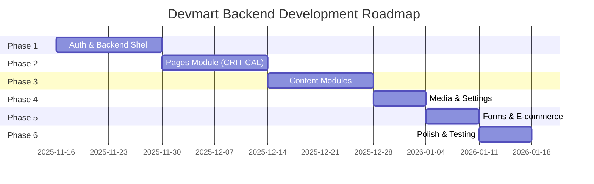
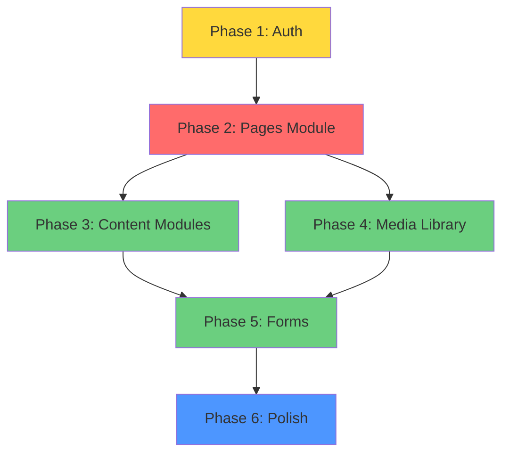

# Devmart Backend - Development Roadmap

**Version:** 1.0.0  
**Last Updated:** 2025-11-15  
**Total Duration:** 9 weeks

---

## Roadmap Overview

This roadmap outlines a **phased approach** to building the Devmart backend, prioritizing the most critical features first while maintaining flexibility for iterative improvements.

---

## Phase 1: Foundation & Authentication (Weeks 1-2)

**Duration:** 14 days  
**Start Date:** 2025-11-16  
**End Date:** 2025-11-29

### Goals
- Establish backend infrastructure
- Implement secure authentication
- Create admin panel structure
- Enable user role management

### Deliverables

#### Week 1: Backend Setup & Auth Backend
- [x] Enable Lovable Cloud
- [ ] Create database schema for auth (users, roles, profiles)
- [ ] Implement Row Level Security (RLS) policies
- [ ] Create `has_role()` security definer function
- [ ] Build edge functions for signup, login, password reset
- [ ] Add rate limiting to auth endpoints
- [ ] Test auth flows with different roles

#### Week 2: Auth Frontend & Admin Layout
- [ ] Create login page UI
- [ ] Create password reset flow
- [ ] Build `useAuth` custom hook
- [ ] Implement protected route logic
- [ ] Create `BackendLayout` component (sidebar, topbar, breadcrumbs)
- [ ] Add admin SCSS styling
- [ ] Create dashboard placeholder
- [ ] Build user management page (super admin only)
- [ ] Test role-based access control

### Success Criteria
- [x] Admin can log in with email/password
- [ ] Admin can reset forgotten password
- [ ] Super admin can assign/revoke user roles
- [ ] Backend layout renders correctly
- [ ] All admin routes are protected by auth
- [ ] Role checks work correctly (admin, editor, viewer)

### Risks & Mitigations
- **Risk:** RLS recursion errors  
  **Mitigation:** Use security definer functions
- **Risk:** Session not persisting  
  **Mitigation:** Store full session object, not just user

---

## Phase 2: Pages Module & UI Block Integration (Weeks 3-4) ⚠️ CRITICAL

**Duration:** 14 days  
**Start Date:** 2025-11-30  
**End Date:** 2025-12-13

### Goals
- Build dynamic page creation system
- Integrate all 36 UI Blocks
- Enable visual page builder
- Support dynamic frontend rendering

### Deliverables

#### Week 3: Pages Backend & List UI
- [ ] Create `pages` and `page_sections` tables
- [ ] Implement RLS for pages (draft vs published)
- [ ] Build edge functions for pages CRUD
- [ ] Build edge functions for sections CRUD
- [ ] Create pages list view in admin
- [ ] Add search, filter, sort functionality
- [ ] Create "Create New Page" flow
- [ ] Add page status management (draft/published)

#### Week 4: Page Builder UI & Frontend Rendering
- [ ] Build UI Block selector component
- [ ] Load blocks from `ui-blocks-registry.json`
- [ ] Create page canvas with drag-and-drop
- [ ] Build block props editor (visual + JSON modes)
- [ ] Add validation for required props
- [ ] Implement save/publish workflow
- [ ] Create dynamic page renderer for frontend
- [ ] Map sections to UI Block components
- [ ] Handle 404 for non-existent pages
- [ ] Add preview mode

### Success Criteria
- [ ] Admin can create pages with custom slugs
- [ ] Admin can add UI Blocks to pages
- [ ] Admin can reorder blocks via drag-and-drop
- [ ] Admin can edit block properties
- [ ] Admin can publish/unpublish pages
- [ ] Frontend renders dynamic pages from database
- [ ] All 36 UI Blocks work correctly
- [ ] Props validation prevents errors

### Risks & Mitigations
- **Risk:** Complex props structure  
  **Mitigation:** Start with simple blocks, iterate
- **Risk:** Performance issues with many blocks  
  **Mitigation:** Implement pagination, lazy loading
- **Risk:** Frontend render errors  
  **Mitigation:** Add error boundaries, fallback UI

### Key Dependencies
- UI Blocks must be properly documented
- Props structure must be consistent
- Zivan SCSS must remain intact

---

## Phase 3: Content Modules (Weeks 5-6)

**Duration:** 14 days  
**Start Date:** 2025-12-14  
**End Date:** 2025-12-27

### Goals
- Implement all content modules
- Enable CRUD operations for each module
- Connect frontend to database
- Support rich content (blog editor)

### Deliverables

#### Week 5: Blog, Portfolio, Services
- [ ] Create database tables for blog, portfolio, services
- [ ] Implement RLS policies
- [ ] Build admin list pages for each module
- [ ] Build admin forms (create/edit)
- [ ] Integrate rich text editor (TipTap) for blog
- [ ] Add image upload support
- [ ] Build edge functions for each module
- [ ] Update frontend pages to fetch from database

#### Week 6: Team, FAQs, Navigation
- [ ] Create database tables for team, FAQs, navigation
- [ ] Build admin UI for each module
- [ ] Add drag-and-drop reordering
- [ ] Implement nested navigation (mega menu)
- [ ] Build edge functions
- [ ] Update frontend Header/Footer to use dynamic navigation
- [ ] Test all modules end-to-end

### Success Criteria
- [ ] Admin can manage blog posts with rich text
- [ ] Admin can manage portfolio projects with galleries
- [ ] Admin can manage services with icons
- [ ] Admin can manage team members with social links
- [ ] Admin can manage FAQs with categories
- [ ] Admin can configure header/footer navigation
- [ ] Frontend displays all content from database

### Risks & Mitigations
- **Risk:** Rich text editor integration issues  
  **Mitigation:** Use battle-tested library (TipTap)
- **Risk:** Data migration from static JSON  
  **Mitigation:** Create migration scripts

---

## Phase 4: Media Library & Settings (Week 7)

**Duration:** 7 days  
**Start Date:** 2025-12-28  
**End Date:** 2026-01-03

### Goals
- Build centralized media library
- Support file uploads (images, PDFs)
- Enable site-wide settings management
- Integrate media picker across admin

### Deliverables

#### Media Library
- [ ] Create `media_library` table and storage bucket
- [ ] Build file upload component with drag-and-drop
- [ ] Implement WebP conversion for images
- [ ] Generate thumbnails automatically
- [ ] Add alt text editor
- [ ] Build media grid view with search/filter
- [ ] Create media picker modal (reusable)
- [ ] Add bulk delete functionality

#### Settings Module
- [ ] Create `site_settings` table
- [ ] Build settings UI (general, company, social, SEO)
- [ ] Add logo upload (light/dark)
- [ ] Add favicon upload
- [ ] Build edge functions for settings
- [ ] Update frontend to use dynamic settings (header, footer)

### Success Criteria
- [ ] Admin can upload multiple files at once
- [ ] Images automatically convert to WebP
- [ ] Admin can edit alt text for accessibility
- [ ] Media picker works across all modules
- [ ] Admin can update site settings
- [ ] Frontend reflects settings changes immediately

### Risks & Mitigations
- **Risk:** Large file uploads timing out  
  **Mitigation:** Implement chunked uploads
- **Risk:** Storage costs  
  **Mitigation:** Add file size limits, monitor usage

---

## Phase 5: Forms & E-commerce Foundation (Week 8)

**Duration:** 7 days  
**Start Date:** 2026-01-04  
**End Date:** 2026-01-10

### Goals
- Connect contact forms to database
- Build admin inbox for form submissions
- Create basic product management (for existing shop pages)

### Deliverables

#### Contact Forms
- [ ] Create `contact_submissions` table
- [ ] Build edge function to receive submissions
- [ ] Add rate limiting (spam prevention)
- [ ] Update frontend form to submit to API
- [ ] Add success/error toast notifications

#### Forms Inbox
- [ ] Create admin inbox page
- [ ] Display submissions in table with filters
- [ ] Add mark as read/unread
- [ ] Add delete submission
- [ ] Add export to CSV

#### E-commerce Foundation
- [ ] Create `products` table
- [ ] Build admin product list page
- [ ] Build product form (create/edit)
- [ ] Add multiple image upload for products
- [ ] Build edge functions for products
- [ ] Update frontend shop pages

### Success Criteria
- [ ] Contact form submissions save to database
- [ ] Admin can view form inbox
- [ ] Admin can manage form submissions
- [ ] Admin can manage products
- [ ] Frontend shop displays products from database

### Risks & Mitigations
- **Risk:** Spam submissions  
  **Mitigation:** Rate limiting, CAPTCHA (future)

---

## Phase 6: Polish & Testing (Week 9)

**Duration:** 7 days  
**Start Date:** 2026-01-11  
**End Date:** 2026-01-17

### Goals
- Refine UX/UI
- Performance optimization
- Comprehensive testing
- Security audit

### Deliverables

#### Reusable Components
- [ ] Create reusable `DataTable` component
- [ ] Create `ConfirmDialog` component
- [ ] Create `Toast` notification system
- [ ] Create `LoadingSpinner` component
- [ ] Create `EmptyState` component

#### Error Handling
- [ ] Add global error boundary
- [ ] Add API error handling with user messages
- [ ] Add form validation error displays
- [ ] Add 404 pages for admin routes

#### Performance
- [ ] Add database query caching
- [ ] Optimize all images to WebP
- [ ] Add lazy loading for admin routes
- [ ] Add pagination to all list views
- [ ] Add CDN headers for media

#### Testing
- [ ] Test all auth flows
- [ ] Test all CRUD operations
- [ ] Test RLS policies with different roles
- [ ] Test dynamic page rendering
- [ ] Test media uploads
- [ ] Load test API endpoints
- [ ] Security audit (input validation, XSS, CSRF)

#### Documentation
- [ ] Write admin user guide
- [ ] Write developer documentation

### Success Criteria
- [ ] All features work correctly
- [ ] No security vulnerabilities
- [ ] Page load times < 2 seconds
- [ ] Admin can complete tasks without errors
- [ ] Documentation is complete

---

## Post-Launch: Future Enhancements (Weeks 10+)

### Short-Term (Months 2-3)
- [ ] Email notifications (form submissions, publishing)
- [ ] Advanced analytics dashboard
- [ ] Multi-language support (i18n)
- [ ] Advanced SEO tools (sitemap, robots.txt)
- [ ] Scheduled publishing

### Medium-Term (Months 4-6)
- [ ] Revision history and versioning
- [ ] Workflow approvals (Editor → Admin → Publish)
- [ ] Custom UI Block creator
- [ ] Advanced search (Algolia integration)
- [ ] Email marketing integration

### Long-Term (Months 7-12)
- [ ] Full e-commerce (cart, checkout, payments)
- [ ] Multi-site support
- [ ] Advanced permissions (field-level access)
- [ ] API for third-party integrations
- [ ] Mobile app (React Native)

---

## Critical Path Analysis

**Critical Path:**  
Phase 1 → **Phase 2 (Pages Module)** → Other Modules → Polish

**Bottleneck:** Pages Module is the most complex and blocks frontend dynamic rendering.

---

## Resource Allocation

| Phase | Developer Time | Complexity | Priority |
|-------|---------------|------------|----------|
| Phase 1 | 14 days | Medium | HIGH |
| Phase 2 | 14 days | **Very High** | **CRITICAL** |
| Phase 3 | 14 days | Medium | HIGH |
| Phase 4 | 7 days | Medium | MEDIUM |
| Phase 5 | 7 days | Low | MEDIUM |
| Phase 6 | 7 days | Medium | HIGH |

**Total:** 63 days (~9 weeks)

---

## Risk Register

| Risk | Impact | Probability | Mitigation Strategy |
|------|--------|-------------|---------------------|
| RLS recursion errors | High | Medium | Use security definer functions |
| Pages Module complexity | Very High | High | Break into smaller tasks, iterate |
| Performance degradation | High | Medium | Add caching, optimize queries |
| Security vulnerabilities | Very High | Low | Security audit, input validation |
| Scope creep | Medium | High | Stick to MVP, defer enhancements |
| Data migration issues | Medium | Medium | Test with sample data first |
| Rich text editor bugs | Medium | Medium | Use proven library (TipTap) |

---

## Success Metrics

### Technical Metrics
- [ ] All 213 tasks completed
- [ ] 100% RLS policy coverage
- [ ] 0 critical security vulnerabilities
- [ ] Page load time < 2 seconds
- [ ] API response time < 500ms (95th percentile)

### Business Metrics
- [ ] Admin can create page in < 5 minutes
- [ ] Admin can publish content without developer help
- [ ] Zero downtime during deployment
- [ ] User satisfaction: 8/10 or higher

---

## Communication Plan

### Weekly Standup
- **When:** Monday 10 AM
- **Duration:** 30 minutes
- **Attendees:** Dev team, stakeholders
- **Agenda:** Progress update, blockers, week plan

### Sprint Review
- **When:** End of each phase
- **Duration:** 1 hour
- **Attendees:** Dev team, stakeholders, users
- **Agenda:** Demo completed features, gather feedback

### Retrospective
- **When:** End of each phase
- **Duration:** 45 minutes
- **Attendees:** Dev team
- **Agenda:** What went well, what to improve

---

## Handoff Plan

### Phase 2 → Phase 3 Transition
- Demo page builder to stakeholders
- Verify all UI Blocks work correctly
- Get approval before proceeding

### Phase 5 → Phase 6 Transition
- Feature freeze
- Focus on testing and bug fixes
- Prepare launch checklist

---

## Launch Checklist

- [ ] All phases complete
- [ ] Security audit passed
- [ ] Performance benchmarks met
- [ ] Documentation complete
- [ ] Admin user training complete
- [ ] Backup strategy in place
- [ ] Monitoring tools configured
- [ ] Rollback plan ready
- [ ] Stakeholder approval

---

**End of Roadmap**
